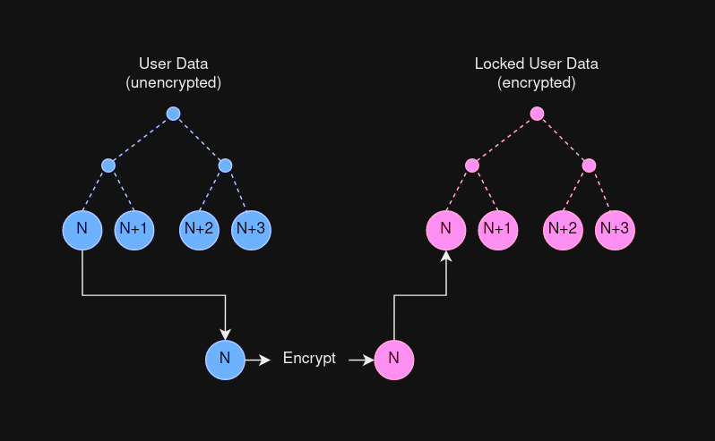

# Big Mutable Files With Protocol Iteraction
## Motivation
This design is thought with three core values in mind, that should guide the decision process when more than one option is presented:

- **Decentralization**: No application relying on data stored by this system should be able to be stopped by a single point of failure in this system. This often implies decentralisation to prevent that single point of failure.
- **User simplicity**: Storing the data stored in the system should be hustle free.
- **Reliability**: Users should be at ease that data stored in this system will not be taken down or made unavailable.

The idea behind this design is to provide the *simplest* user experience and the *maximum* decentralization. This means that users would only have to provide the data and pay for the storage, and the protocol will handle the rest:
- Data allocation -> how the Storage Units are defined. (see [Game Theory](#game-theory))
- Number of replications.
- Payment distribution between Storage Units. 

## General requirements
1. Storage should be off-chain.
2. We need storage providers (storage units) to prove that they are actually storing data.
    - Problem: proving Storage Units sent data/user receive it correctly. 
3. Redundancy of storage (as any node can go offline any time).

## Data Management
All data has an **owner** who is responsible for paying the costs of storing it. The owner is represented as a AccountId (EOA, contract, or any XCM account).

The fact that data always has the same owner makes it possible to create namespaces, and to let the owner decide on an arbitrary key adapted to the use case, so that the data can be indexed/retrieved more easily.

### Data Allocation and Replication
The number of replicates is defined by the protocol and is the same for every file. For the allocation of the data and assuring a fixed amount of replicas, an DHT can be used. 
- Each storage provider is assigned a hash range when it registers.
- A pallet (to be developed) can manage the registration and withdrawal of each provider, and therefore the hash range associated with each provider depending on the number of providers and the number N of desired copies.
- The DHT keys consist of the HASH(owner AccountId | arbitrary key).
    - The arbitrary key can be the file content itself?
- The values of the DHT are the nodes that have that data? (@elois will confirm this) 
- For ensuring there are N copies, the key range of a given Storage Provider goes from it neighbor (N/2)-1 at his "left", and the neighbor (N /2)-1 to his "right".
- This way the Storage Providers have data allocated to them randomly.

Specify:
- What does the DHT contains?
    - Which are the keys? -> HASH(owner AccountId | arbitrary key) 
    - Which are the values? -> List of nodes that have that data assigned to them?
- Is there other hash table that store node -> hash range
- How is the process by which tables are populated/modified (when Storage providers are dropped)?
- Research: 
    - How many replicas other storage solutions use to provide security (amazon AWS)
    - How to assure certain level of data availability

## User Interface
This section covers the way in which a user of this system would interact with it in an abstract level. It will be explained the actions that the user takes to upload and retrieve data, but not necessarily the exact means or the appearance of the application that is used to interact. In other words, what this section describes is how much of the inner workings of the system the user is exposed to:

The idea behind this design is to provide the simplest user experience. This means that users would only have to provide the data and pay for the storage, and the protocol will handle the rest:
- Data allocation -> how the Storage Provider is defined.
- Number of replications.
- Payment distribution between Storage Providers. 

### Data upload
To maximize system decentralization, the user is abstracted from which Storage Provider will store his data. This means that the user only need to:
1. requests storage service on-chain through XCM message, and places funds temporarily on hold.
2. The protocol randomly choose the Storage Providers in charge of that data. (see [data allocation])
3. Storage Provider receives message, opens off-chain channel for exchanging data, and stores it.
4. Storage provider generates proof that the data has been stored, posts it on-chain to release funds placed on hold by the user. (see [payments](#paying-model))

### Data retrieval
We propose a provider payments mechanism that enhances efficiency and integrity. The foundation of this approach hinges on a one-time encryption mechanism combined with an optimistic fraud proof workflow to ensure provider honesty.

#### Encryption Methodology
- The data is segmented and encrypted on a per-merkle-node basis.
- A fresh merkle tree of encrypted data is formulated while retaining the same tree structure, as can be seen in the following diagram.



#### Verification Mechanism
One of the unique features of this method is the ability to determine the correctness of the provided encryption key and encrypted data. This is based on having both the merkle root of the encrypted and decrypted trees and the associated proofs. Below is a pseudo-code for the verification function:

```rust
fn verify(transaction_id, decrypted_merkle_root, encrypted_merkle_root, decrypted_merkle_proof, encrypted_merkle_proof, key) {
    // Ensure the roots and key correspond to the known on-chain data.

    // Validate both proofs.
    verify_proof(decrypted_merkle_proof, decrypted_merkle_root);
    verify_proof(encrypted_merkle_proof, encrypted_merkle_root);

    // Confirm that the leaf nodes provided by the proofs share the same tree position.

    // Decrypt the encrypted leaf node.
    let provided_node_decrypted = decrypt(encrypted_merkle_proof.leaf, key);
    
    // Ensure it matches the decrypted one.
    // As we've verified the provided decrypted proof against the on-chain merkle root,
    // we can now ascertain whether the provided data is accurate for this specific node.
    ensure_eq(provided_node_decrypted, decrypted_merkle_proof.leaf);

    return Ok(());
}
```

#### Workflow

The following workflow is proposed for the retrieval of data:

1. **Off-chain:**
    - The user requests data.
    - The provider generates a one-time encryption key.
    - The provider devises a new merkle tree (as illustrated in the previous diagram).
    - The provider dispatches the encrypted merkle tree data to the user.
2. **On-chain:**
    - The user submits the merkle root of the encrypted tree and commits to payment.
    - To deter abuse and promote state clean-up subsequently, the user secures some funds.
    - Upon making the key accessible by the provider, payment is transacted.
3. **Optional Fraud Proof:**
    - If a user identifies an erroneous encryption key upon paying for a download, they can offer proof during a designated fraud window.
    - If the proof is verified as genuine, the provider faces significant penalties.
    - Additionally, the user obtains a refund or incentive as redress.

#### Fraud Proof
Fraud proofs serve as an essential component to ensure that transactions between the user and provider are carried out with the utmost integrity.

The user is able to verify the integrity of the data in the following way:

1. **Receipt of Encrypted Merkle Tree:**
    - The user obtains the encrypted merkle tree data from the storage provider.
2. **On-chain Storage of Decrypted Merkle Root:**
    - The merkle root of the decrypted data is securely stored on-chain at the time of first storage.
3. **Decryption and Verification:**
    - Post-payment, the user receives the decryption key from the provider.
    - Using this key, the user can decrypt the previously received merkle tree data.
    - Once decrypted, the user can compute the merkle root of this data.
    - The computed merkle root is then cross-checked with the one stored on-chain. If both match, it confirms the integrity of the data and the honesty of the provider. If they don’t match, it signals a possible discrepancy or foul play.

In case of a discrepancy, the user can submit a fraud proof to the chain, where it will be verified by the chain and the provider will be penalized accordingly.

#### Economic Consideration
This protocol must have an economic incentive for the storage provider such that it is more costly for it to go through the claim process than to directly serve the data to the user. Otherwise, it may be the case that the Storage Provider does have the data, but refuses to give it to the user. The user makes a claim and the Storage Provider can pass the claim positively.

## Game Theory
This design treats every Storage Provider exactly the same to ensure maximal decentralization, thats why we talk about "Storage Units" that have a target data size set by on-chain governance. Then potentially one Storage Provider could spin up multiple storage units if there is a demand for it.

- All Storage Units should earn exactly the same rewards, no matter how much data the protocol assigns to them. Otherwise, storage providers may be tempted to unregister and re-register under a different position in the DHT to optimize their rewards.
- Rewards should be paid over a period where the set of providers is constant (i.e., per session).
- Each Storage Provider can only receive its rewards once it has proven that it has stored everything it needs to store for a given session (via a ZKP). This way, we incentivize them to prove they are storing data.
- The price should be simple and constant for all users and not depend on the nature of the data, ideally a fixed price in DOT/byte or DOT/byte/duration depending the paying model.

### Paying model
- **Simple rent pay**:
The price is fixed at DOT/byte/duration. To simplify it, the user can deposit an arbitrary amount of tokens from which the payment per unit of time will be deducted. This way, the data expiration date is also deducted.

Then the expected reward for Storage Units is:

reward = D*PS/n
D is total data size (in bytes)
P is storage price in DOT/byte/session
Sn is the number of storage providers

This formula has the advantage of increasing the yield (in DOT) when the size of the data increases, which encourages new actors to become storage providers until the yield returns to an equilibrium point which depends on the market.

**Pros**: It's a very simple payment model.
**Cons**: This model has the disadvantage of providing a suboptimal user experience since the user must be careful not to lose their data when the deposit runs out.

- **Locked DOT**:
Leveraging the fact that this would be a system parachain, a model could be implemented in which users lock `X` DOT for `Y` MB of data, and get those same `X` DOT back as soon as they free the storage space. While the DOT is locked, the file should be securely stored. 
1. The price to pay is the opportunity cost and DOT's inflation.
2. The incentive for the Storage Provider would be programming some logic in the runtime so that those `X` DOT are staked and the Storage Provider can claim the staking rewards.

**Pros**: 
- Encourages the release of data when it is no longer needed to be stored.
- It can be selled by "free" storage.

**Cons**:
- Makes the rewards of storage providers dependent on an external market (stakeholder market)

# Access Control
Data cannot change ownership, so it's preferable that the owner itself be transferable. 
`AccountId` can use the [Proxy Pallet](https://github.com/paritytech/polkadot-sdk/blob/master/substrate/frame/proxy/README.md) to assign permissions to other accounts or to transfer ownership.
# Proofs
> Same for both
# Mutability
> Same for both