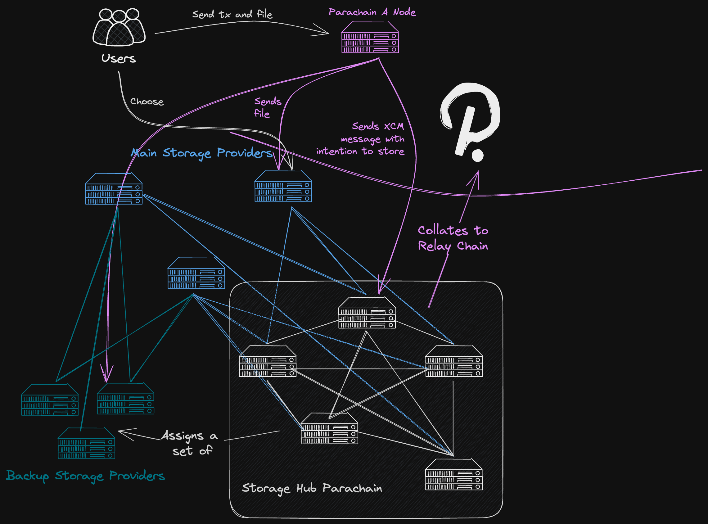
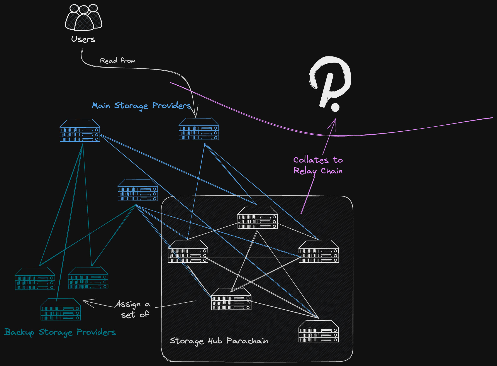
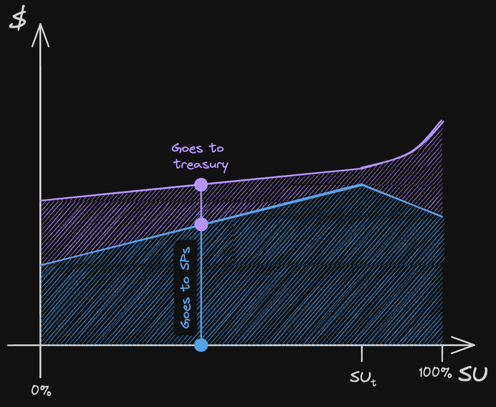
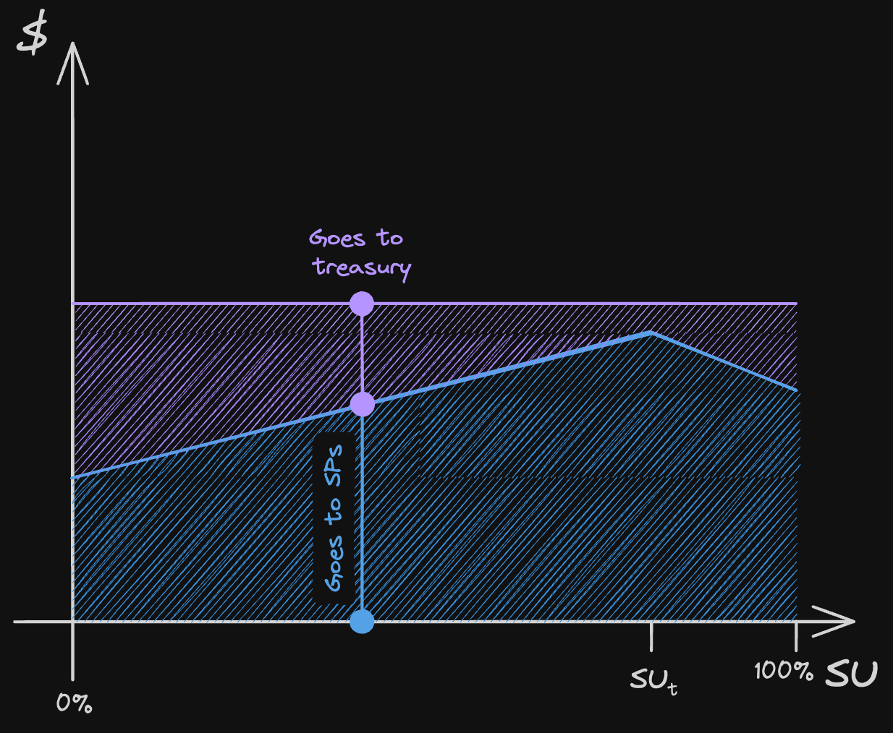

# Motivation
This design is ideated with three core values in mind that should guide the decision process when more than one option is presented:
1. **Unstoppability**: No application drawing from this system's data should be vulnerable to a single point of failure within the system. This often implies decentralisation to prevent that single point of failure, but it is not the only characteristic that should be taken into account, as it could conflict with the next value...
2. **User simplicity**: Storing and most importantly accessing the data stored in the system should be hassle-free.
3. **Reliability**: Users should be at ease that data stored in this system will not be taken down or made unavailable.
The key value proposition of this approach is to foster a marketplace of Storage Providers with unique value propositions for data retrieval, that appeal to the different Web3 use cases and requirements we can imagine a storage chain could have, and those who do not yet exist but could arise in the future. While competition between Storage Providers would bring better service to users, it should be acknowledged that it could also be a centralisation vector. This protocol is designed so that if that is the case, the centralisation is a consequence of good quality of service, and not because users are locked in, ensuring that users are always able to switch providers seamlessly. Hence, the unstoppability.
# User Interface
This section covers the way in which a user of this system would interact with it in an abstract level. It will be explained the actions that the user takes to upload and retrieve data, but not necessarily the exact means or the appearance of the application that is used to interact. In other words, what this section describes is how much of the inner workings of the system the user is exposed to.

When talking about "the user" in this section, it should be thought as a Polkadot parachain or relay chain, interacting with Storage Hub through XCM (or a similar communication channel), or an application running on that parachain, to whom the parachain exposes the interaction with Storage Hub. It is expected that dApps would interact directly with Storage Hub but mostly to retrieve/upload data that is managed by other parachains.
## Uploading Data

There is a public list of available [Main Storage Providers](bigMutableProviderInteraction.md#Main-Storage-Providers-vs-Backup-Storage-Providers) that offer their service in an open market. Users can compare characteristics of Storage Providers to select at least one as their Main Provider. Such characteristics include:
1. Amount of data stored.
2. Price charged for storing the data (for more information about payment see [Payment](bigMutableProviderInteraction.md#Payment)).
3. Data limits.
4. Network traffic for retrieval limit.
5. Retrieval speed.
6. Kind of data they allow (i.e. if they have to abide by local legislation).
7. Location of the servers storing the data.
8. CDN support (multi location server).
9. Protocols supported (HTTP, FTP, IPFS, WS, etc.)
10. Reputation score (pending how it should be fairly calculated).
11. Additional services (statistics, partial queries for structured data, auth, etc.)
The Storage Provider agrees to uphold the conditions advertised, and the user should be given all the information it needs to make a sensible decision.

The user informs the choice of [Main Storage Provider](bigMutableProviderInteraction.md#Main-Storage-Providers-vs-Backup-Storage-Providers) through an on-chain transaction, while the data is transferred off-chain in peer-to-peer communication between the parachain / relay chain node, and the Storage Provider. Once this is done, the Storage Provider is eligible to collect payments, contingent upon proving that it continues to store the data when prompted. For more details on proofs, please refer to the [Proofs](bigMutableProviderInteraction.md#Proofs) section.

At any point in time, if the user feels the Main Storage Provider is not upholding their side of the deal, it can change and use another Storage Provider as their Main Provider. The data does not need to be re-uploaded to the new Main Storage Provider, since it would request it from the previous one. If that is not possible due to legitimate issues, censorship, or dishonest behaviour, the data can be retrieved from [Backup Storage Providers](bigMutableProviderInteraction.md#Main-Storage-Providers-vs-Backup-Storage-Providers).
## Retrieving Data

There is an on-chain Distributed Hash Table (DHT) that links a file to the ID of the [Main Storage Provider](bigMutableProviderInteraction.md#Main-Storage-Providers-vs-Backup-Storage-Providers) who exposes it, and also to the [Backup Storage Providers](bigMutableProviderInteraction.md#Main-Storage-Providers-vs-Backup-Storage-Providers). The [Main Storage Provider](bigMutableProviderInteraction.md#Main-Storage-Providers-vs-Backup-Storage-Providers) maintains an on-chain "profile" with the appropriate information for retrieving data from it, which happens off-chain. A file is identified by the hash of its location, and the location is the concatenation of the `AccountId` owner of the file, and an arbitrary path. For example, for `AccountId = 12345`, the file whose path is `cool_project/v1/logo` is identified by `hash(/12345/coolproject/v1/logo)`. Account IDs can be considered to have a dedicated "drive". The reason for this location-addressed system is to allow for modification and upgradability of files.

The existence of a [Main Storage Provider](bigMutableProviderInteraction.md#Main-Storage-Providers-vs-Backup-Storage-Providers) is primarily for providing a hassle-free retrieval user experience. The Storage Provider is tasked with making data retrieval channels available, as stipulated by its advertised services and agreed upon by the user who selected it. For example, a Storage Provider may offer exposing the data through an HTTP endpoint, with a given maximum request rate limit, hosted in a given region, and with a given network bandwidth. Another Storage Provider could also offer access through WebSocket or IPFS as its value proposition. Ultimately, the objective is to foster a competitive open market where Storage Providers compete for selection as a [Main Storage Provider](bigMutableProviderInteraction.md#Main-Storage-Providers-vs-Backup-Storage-Providers) by offering unique value propositions for data retrieval, thereby appealing to various user needs. This way, the system as a whole is flexible enough to serve use cases that go from mission-critical data retrieval applications, to cheap/free NFT storage.

The reason behind this model for data retrieval is to avoid complexity in trying to prove on-chain that the Storage Provider's served the data, which for large files, would necessarily have to be transferred off-chain. Proving that the Storage Provider served the requested data to the requesting user, without trusting any of the two (i.e. assuming any of the two could be malicious), can be extremely cumbersome and impractical.

Although good for simplicity of data retrieval, it should be acknowledged that this open market competition may lead to centralisation in a handful of Storage Providers that, due to reputation, superior value propositions, or even default options in dApps, end up being the [Main Storage Provider](bigMutableProviderInteraction.md#Main-Storage-Providers-vs-Backup-Storage-Providers) choice for most of the users. However, the unstoppability goal can still be accomplished through the role of [Backup Storage Providers](bigMutableProviderInteraction.md#Main-Storage-Providers-vs-Backup-Storage-Providers). These alternative Storage Providers store a backup of the data to ensure that users can always permissionlessly change their [Main Storage Provider](bigMutableProviderInteraction.md#Main-Storage-Providers-vs-Backup-Storage-Providers), even when this one is reluctant or unable to serve the data back.
# Access Control
In this system, reading and writing to a file are fundamentally distinct actions. Writing involves an on-chain transaction where the user posts the request for storing a file, and pays according to the defined payment method (see [Payment](bigMutableProviderInteraction.md#Payment)). The user then transfers the file data through an off-chain channel, and then the Storage Provider proves it is storing the file, to be compensated. In this process, it can be verified on-chain that the user who initiates the writing request is allowed to do so, otherwise the transaction is invalid.

Reading is a completely off-chain action, where the [Main Storage Provider](bigMutableProviderInteraction.md#Main-Storage-Providers-vs-Backup-Storage-Providers) is supposed to serve the file to the user requesting it, provided the latter has access, but there is no way to verify on-chain that the [Main Storage Provider](bigMutableProviderInteraction.md#Main-Storage-Providers-vs-Backup-Storage-Providers) is upholding the reading permissions set for that file. So there are two ways to approach this: by trusting the [Main Storage Provider](bigMutableProviderInteraction.md#Main-Storage-Providers-vs-Backup-Storage-Providers), and change it should it misbehave, or through file encryption.
## Writing Permissions
An `AccountId` in Storage Hub is the owner of a file, and it is the only one (at first) able to assign permissions to any other `AccountId` over that file. An `AccountId` in Storage Hub can be controlled by different kinds of entities. Some examples include:
1. An EOA that sends transactions directly to Storage Hub.
2. An account from a different parachain that sends messages through XCM.
3. A parachain sending messages through XCM.
4. The relay chain sending messages through XCM.
5. A pallet from another parachain sending messages through XCM.
6. A smart contract from another parachain sending messages through XCM.

The common pattern in all of the previous is that they send messages through XCM, except for the first case. But in fact, all of them can be thought as "locations" in the XCM language, where in the first case, the origin location does not come from outside of Storage Hub.

An `AccountId` can assign permissions to these locations specifically (for example to the location of parachain `A`, or account `1` in pallet `2` of parachain `B`) and those permissions can be
1. Write
2. Mutate
3. Manage (assign permissions over that file)
4. Not Write
5. Not Mutate
6. Not Manage

 Wildcards are allowed when assigning permissions to locations. For example, the location `0/polkadot/parachain_a/*` would be used to allow writing operations from any requests coming from locations under `parachain_a`, whereas `0/polkadot/parachain_a` allows writing only from messages whose sender *is* `parachain_a` itself. This enables assigning permissions to a larger group of individuals at once, which could be all accounts in a given collective registered in a Collectives pallet of a parachain. That is also the reason why negative permissions exist, to disallow a specific user or group of users, who belong to a group that is allowed by a wildcard. Negative permissions have the last say when in conflict with positive permissions.
## Reading Permissions
Reading permissions cannot be assigned to groups in the same way as writing permissions, because reading does not involve an on-chain action like a transaction or XCM message that can be checked where it came from. So instead, it is proposed for reading permissions to be NFTs in Storage Hub that represent the credentials, and this NFTs could be configurable by the permissions issuer to allow transfers or not. Whoever requests reading a file from a [Main Storage Provider](bigMutableProviderInteraction.md#Main-Storage-Providers-vs-Backup-Storage-Providers) should provide a valid signature from an account that holds the corresponding NFT credentials. A special case for Collectives could be considered, should users have a way to prove they belong to a Collective.

There are two options when it comes to enforcing reading permissions: trusting the [Main Storage Provider](bigMutableProviderInteraction.md#Main-Storage-Providers-vs-Backup-Storage-Providers) to enforce them and change to another if fails to do so, or add a layer of encryption. The first one is understandably simpler to implement, but gives less guarantees to the user. Adding a layer of encryption comes with the difficulty of sharing the encryption secrets properly and avoiding leaks. One model that could be implemented is for the owner of the file to divide the encryption keys using Shamir Secret Sharing, and distributing the secret among a subset of Storage Hub nodes. Then when reading the file, the user gets the encrypted blob from the [Main Storage Provider](bigMutableProviderInteraction.md#Main-Storage-Providers-vs-Backup-Storage-Providers), and then communicates with Storage Hub's nodes to retrieve the pieces and reconstruct the encryption keys. The user should prove to the nodes that it possesses the corresponding NFT credentials through a valid signature, and the retrieval of the pieces should be communicated through and encrypted channel. 
# Game Theory
The aim of this section is to provide a system design that naturally incentivises the actors in it to behave in a way that benefits the system as a whole. These behaviours are:
1. Storage Providers should want to provide storage space when there's demand for it.
2. Data stored by Storage Providers should be readily available in hot storage.
3. Storage Providers should be able to prove they continue to store the data they committed to store regularly.
4. [Main Storage Provider](bigMutableProviderInteraction.md#Main-Storage-Providers-vs-Backup-Storage-Providers) should serve the data according to their advertised offer.
5. [Backup Storage Provider](bigMutableProviderInteraction.md#Main-Storage-Providers-vs-Backup-Storage-Providers) should have the data ready to transfer to another [Main Storage Provider](bigMutableProviderInteraction.md#Main-Storage-Providers-vs-Backup-Storage-Providers) upon a valid request.
6. There should be a low barrier of entry for new Storage Providers who want to offer their services and start a earning profits from it.
7. There should be a reasonably stable/predictable revenue expected for Storage Providers.
8. There should be a reasonably stable/predictable cost expected by users.
9. Data stored by [Backup Storage Provider](bigMutableProviderInteraction.md#Main-Storage-Providers-vs-Backup-Storage-Providers) should be as distributed and not concentrated in a handful of Storage Providers.
10. [Main Storage Providers](bigMutableProviderInteraction.md#Main-Storage-Providers-vs-Backup-Storage-Providers) should be able to terminate their service provided to a user, with an anticipation of at least one billing period, and not receive any compensation after that.
11. Users should pay for the service given by Storage Providers.
12. Users should be able to choose the Storage Provider that gives them the best service.
13. Users should not be locked in to one [Main Storage Provider](bigMutableProviderInteraction.md#Main-Storage-Providers-vs-Backup-Storage-Providers), and easily switch to another at will.
14. Users should be able to terminate their contract/subscription with a [Main Storage Provider](bigMutableProviderInteraction.md#Main-Storage-Providers-vs-Backup-Storage-Providers) at will, and not be charged after that billing period.
15. Users should be able to terminate their contract/subscription with Storage Hub as a whole, meaning that they will no longer pay for [Main Storage Provider](bigMutableProviderInteraction.md#Main-Storage-Providers-vs-Backup-Storage-Providers) nor for their data to be safely stored in [Backup Storage Provider](bigMutableProviderInteraction.md#Main-Storage-Providers-vs-Backup-Storage-Providers), and not to be charged after that billing period.
16. Users should clean up unused storage.

With these goals in mind, the system should provide positive incentives to guide behaviours, and negative incentives to punish them if they misbehave. Positive incentives are preferred to make actors willingly act in the expected way, and negative ones should be a last resort and only used for proven bad actors.

The incentives should also be guided by target parameters that can be modified by governance of the Storage Hub. These are:
1. Price for storing data in *Backup Storage Provider*: cost in {currency} for storing 1 unit of storage. For *Main Storage Providers*, they set their cost based on their value proposition.
2. Target System Utilisation: the ratio given by $SU_t = \frac{\text{Total data stored in Storage Hub}}{\text{Available storage capacity in Storage Hub}}$
3. Maximum amount of data stored by a single *Backup Storage Provider*.
4. Fraction of users' payment going to *Backup Storage Providers* and treasury.
5. Frequency of payments / rewards distribution (which also determines the frequency in which Storage Providers need to prove they keep storing the data).
6. Amount needed to be staked to become a *Backup Storage Provider*.
7. Escalating steps for staking needed for *Backup Storage Provider* to increase storage capacity.
8. Billing period: period during which a storage service is hired and paid for; can be thought of as "monthly subscription".
## Main Storage Providers vs Backup Storage Providers
Before moving on to the actual incentives specification, the difference between a *Main* and a *Backup Storage Provider* should be explained. The *Main Storage Provider* is the one that stores the full file given by the user, and exposes the means for retrieving the data off-chain. For a given file, there are`N` *Backup Storage Providers*, where `N` is determined in [Replications](bigMutableProviderInteraction.md#Replications). The job of a *Backup Storage Provider* is to store a piece of the file, and have it readily available to be served to another Storage Provider, if the user assigns it as the new *Main Storage Provider*. That means a *Backup Storage Provider* does not need to expose the piece of data for public retrieval.

Both kinds of Storage Providers are required to regularly prove they keep storing the data they committed to, but their roles in the system are different. *Main Storage Providers* are there to provide convenience and simplicity for data retrieval. They are supposed to compete for user adoption, and it is expected that a certain degree of centralisation will happen. They are also trusted parties when it comes to expecting them to allow data retrieval. *Backup Storage Providers* are there in case that trust is broken, so that the user can freely choose another *Main Storage Provider*, and they can rest assure that the data is available in Storage Hub to do so. *Backup Storage Providers* do not compete, as they do not offer a distinctive service to one another, and they are not chosen by the user. Instead, they are assigned by the system, with considerations to have an even distribution of data.

The users' payment for storing a file is distributed between *Main* and *Backup Storage Providers* (and a small fraction goes to the treasury). The amount going to the *Main Storage Provider* is agreed upon when the user selects that *Main Storage Provider*, but normally it would be substantially higher than what a *Backup* provider receives, because they have to provide the infrastructure for convenient data retrieval. What doesn't go to the *Main* provider, gets evenly distributed between the assigned *Backup* providers. For example, if a user is paying 10 units of currency, and the *Main Storage Provider* charges 5 units, then the other 5 is distributed among *Backup Storage Providers*.
## Incentives
With all these considerations taken into account, the following incentives are proposed:
1. Payments are distributed regularly and Storage Providers are required to provide [storage proofs](bigMutableProviderInteraction.md#Proofs) in order to get them. The files for which a storage proof is asked should be selected at random so that Storage Providers don't speculate with having some data in hot storage and some in cold.
2. The algorithm for selecting a set of [Backup Storage Providers](bigMutableProviderInteraction.md#Main-Storage-Providers-vs-Backup-Storage-Providers) should be pseudo-random with a tendency to select providers with less amount of data stored, relative to the whole network.
3. There should be a minimum staked amount to become a [Backup Storage Providers](bigMutableProviderInteraction.md#Main-Storage-Providers-vs-Backup-Storage-Providers), to prevent a sybil attack to [Backup Storage Providers](bigMutableProviderInteraction.md#Main-Storage-Providers-vs-Backup-Storage-Providers) decentralisation.
4. To increase storage capacity, a [Backup Storage Providers](bigMutableProviderInteraction.md#Main-Storage-Providers-vs-Backup-Storage-Providers) should be required to stake more, but relatively less than signing up a new [Backup Storage Providers](bigMutableProviderInteraction.md#Main-Storage-Providers-vs-Backup-Storage-Providers).
5. Users should pay "continuously", meaning that there should be some kind of cost for the user to keep the file in Storage Hub. For more information see [Payment](bigMutableProviderInteraction.md#Payment).
6. The fraction of the users' payment going to the treasury should follow a curve like the one below. The aim is that when the $SU$ is below $SU_t$ the cost of storage is lower, so users are incentivised to take advantage and store files. On top of that, [Backup Storage Providers](bigMutableProviderInteraction.md#Main-Storage-Providers-vs-Backup-Storage-Providers) are getting paid less per unit of data stored, and a growing percentage goes to the treasury, so they are incentivised to shut down unused storage capacity, and increase their earnings for the capacity that is actually being used. On the other hand, if $SU$ is above $SU_t$ the cost of storage is higher for the user, so it is deterred from storing more files, while the income that [Backup Storage Providers](bigMutableProviderInteraction.md#Main-Storage-Providers-vs-Backup-Storage-Providers) receive is less, so they are incentivised to provide more storage capacity to have better income overall for the capacity being used.

	Alternatively, if there is more interest in  providing a stable price for a more hassle-free user experience, the price could be maintained flat following the next curve, with the disadvantage of loosing the demand-side of incentives:

## Payment
Regardless of the exact method, payments in this design need to work as *money streams*, meaning that there should be a constant flow of monetary incentives that keep requiring the Storage Providers (both kinds) to prove they are still storing the data. The frequency in which this money streams release the payment is a system parameter, and so is the price per unit of data for the  [Backup Storage Providers](bigMutableProviderInteraction.md#Main-Storage-Providers-vs-Backup-Storage-Providers). The latter means that each user pays an amount per file, that is dependent on the size of the file.

When the user announces on-chain its intention for storing a file of a given size, it should be checked that it has enough balance to cover at least one billing period (or more, could be a system setting), and both the  [Main Storage Provider](bigMutableProviderInteraction.md#Main-Storage-Providers-vs-Backup-Storage-Providers) and [Backup Storage Providers](bigMutableProviderInteraction.md#Main-Storage-Providers-vs-Backup-Storage-Providers) assigned will open their peer-to-peer communication channels to receive the data, and will not accept more data than what was requested and agreed to pay for by the user.

Two alternatives are presented as payment methods:
1. **Token Stream**: The user deposits tokens in an account in Storage Hub, and when it agrees to store a given file, with a given [Main Storage Provider](bigMutableProviderInteraction.md#Main-Storage-Providers-vs-Backup-Storage-Providers), as long as that provider and the auto-assigned  [Backup Storage Providers](bigMutableProviderInteraction.md#Main-Storage-Providers-vs-Backup-Storage-Providers) keep proving they store the data, some balance will be deducted from the account regularly. The currency in which the payment is done can be:
	1. *Payment in DOT and price per unit of data valued in DOT*: provides a direct demand driver for DOT, in detriment of a stable/predictable price for storage for users, and revenue for Storage Providers.
	2. *Payment in DOT and price per unit of data valued in USD*: provides a stable/predictable cost for users and revenue for Storage Providers, while still being a demand driver for DOT, but adds dependance on USD and the need for a reliable price oracle. Users still have a variable rate in which their DOT balance is consumed.
	3. *Payment in USD stablecoin and price per unit of data valued in USD*: provides a predictable cost for users, revenue for Storage Providers and a constant consumption of balance in users' accounts. However, it fails to provide a demand driver for DOT, is heavily dependant on USD and still requires a reliable Oracle to defend against stablecoin de-pegs.
2. **DOT Staking**: The user locks a given amount of DOT for the size of the file stored, and it could be advertised as "free storage", since the locked DOT could be returned in full when releasing (deleting) the data. The data is stored as long as the tokens are locked, and the revenue to the Storage Providers comes from staking that locked DOT. In reality, the cost paid by the user is the opportunity cost of locking that DOT.
	As long as Storage Providers keep proving they store the data, they can claim the rewards. The disadvantage, besides a variable cost of storage, and revenue for the Storage Providers, given by the variation in price of DOT, is that it adds a dependency on the staking system, which, for example adds the risk of slashing to Storage Providers and users with their locked DOT.
# Replications
As mentioned in previous sections, there are  [Main Storage Providers](bigMutableProviderInteraction.md#Main-Storage-Providers-vs-Backup-Storage-Providers) and [Backup Storage Providers](bigMutableProviderInteraction.md#Main-Storage-Providers-vs-Backup-Storage-Providers). In principle, there is only one  [Main Storage Provider](bigMutableProviderInteraction.md#Main-Storage-Providers-vs-Backup-Storage-Providers) that stores the entire file for a user, but the option could be made available for users to select more than one, and pay for it accordingly. When it comes to  [Backup Storage Providers](bigMutableProviderInteraction.md#Main-Storage-Providers-vs-Backup-Storage-Providers), the system selects `N` providers to store chunks of the file. Using Erasure Coding, it is assured that as long as `M` out of the `N` providers return their chunks (where `M < N`), the file can be reconstructed. Both `M` and `N` are system parameters.
# Proofs
This section refers to the proofs Storage Providers (*Main* and *Backup* alike) have to submit regularly in order to get paid. The criteria to choose a proofs method consists of:
1. The method should be effective for proving the data is being stored in hot storage, to be readily available.
2. Since the validation of the proof is an on-chain operation, the data needed to validate the proof should be as small as possible, and at most, small enough to fit in a Storage Hub transaction.
3. Implementation simplicity. This would not only lower the costs of a first implementation of Storage Hub, but also decrease the surface for errors, and therefore attacks.

Three approaches are considered:
1. **zk-proofs**: Essentially a proof of execution of a program in a zkVM, which proves that whoever runs it (in this case, Storage Providers) possesses the data they claim to have stored. Some considerations of this approach include setting a designated time frame that gives enough time for the Storage Provider to generate the proof, but also not too much so that it allows them to have the data in cold storage, and potentially some hardware requirements that Storage Providers would need to have to generate them. Filecoin uses zk-SNARKs for this purpose.
2. **Per-file Merkle Trees**: Consists in separating each file into small "leaves" of data and constructing a Merkle Tree with it. The Merkle root would be stored on-chain, and whenever a Storage Provider needs to prove it is still storing the data, it would be assigned a random leaf, and requested to provide the corresponding Merkle proof. The consideration of designated time frames for zk-proofs is applicable here as well. Additionally, Storage Providers would incur the overhead of maintaining a large Merkle Tree for each piece of data they store. However, it is a simpler but effective approach, compared to the previous one.
3. **Hashes + Consensus**: When challenged, Storage Providers would be requested to hash a random input alongside a random piece of data they are supposed to be storing. Then a set of Proof Validators, with access to the data being checked, would check the hash provided, and as soon as enough Validators vouch for it, the proof is accepted. This is the approach taken by BNB Greenfield, and although simpler than others, in the Polkadot ecosystem it implies that trusting the Relay Chain Validators is not enough for other parachains to be confidant that their files are safely stored. In other words, Relay Chain Validators would only be able to validate that enough Proof Validators checked the proof, but not that the proof is valid, so other parachains would have to trust also the Proof Validators.

Given the trust considerations of **Hashes + Consensus**, that alternative is almost automatically ruled out, leaving the decision between the first two. A deeper technical analysis on the computational cost and size of the proofs should be carried out to choose the best one.
# Mutability
This design does not directly address how mutability features will be implemented for this system, but takes it into account by providing various means in which it could be later added. Some of these means and considerations include:
1. By having  [Main Storage Providers](bigMutableProviderInteraction.md#Main-Storage-Providers-vs-Backup-Storage-Providers) include mutability features as part of their value proposition, which could take advantage of co-locating the storage servers with processing servers to run transformations over the data.
2. Considering mutability among the write permissions that can be assigned to a file.
3. In case zk-proofs are chosen to prove data keeps being stored, an implementation for a zkVM could be used, and the on-chain component that verifies the proofs would have a pre-loaded zk-program that is the one responsible for proving the storage. However, it could be extended to accept other zk-programs that modify the data stored, and users could request running that zk-program over some data stored in Storage Hub, compensating the Storage Provider that runs it and provides the corresponding zk-proof.