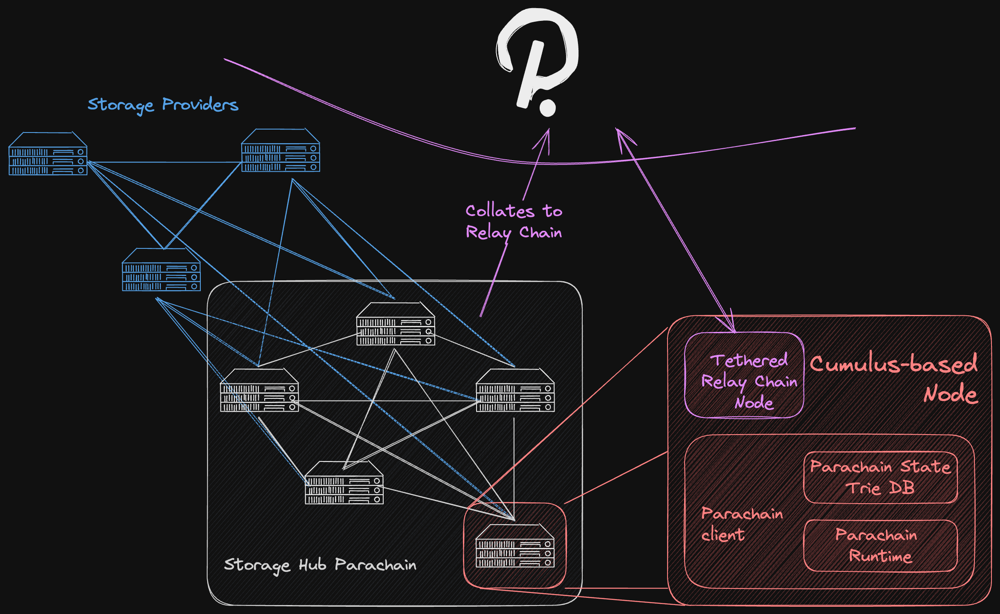

# Storage Hub Design
The design of a storage-oriented system parachain for the Polkadot ecosystem involves a multiplicity of decisions, often interdependent, that determine the exact inner workings, guarantees provided, and use-cases that it caters to. Even within Web3, these use-cases can have very different requirements, that could affect the design in one way or the other. The aim of this document is to expose all the dimensions that were taken into account for an implementation of Storage Hub, briefly introduce two approaches to such a solution, and expand on the one this team considers to add more value to the ecosystem.

When it comes to the design of a storage chain, some of the key questions that should be asked include:
1. **Should the data be stored on-chain or off-chain?** Naturally, the latter adds more value and use-cases, as it enables the storage of large files that would be highly inefficient or impossible to store on-chain. However, it also makes it harder to provide guarantees on data availability, and the assurance of that data actually being stored.
2. **Storage Proofs.** If data is stored off-chain, how can a Storage Provider (some server that is actually storing the data off-chain) prove that it keeps storing the data committed to.
3. **Game Theory.** How can the system provide a set of incentives that make the actors in it naturally align with the interests of the system as a whole? One of the more obvious conclusions here is that Storage Providers should be compensated for the service they provide (i.e. the data they store).
4. **How are permissions managed?** In a decentralised system where your data can be stored in many different servers, how can you enforce access control?
5. **User Interaction**. In other words, who should the user interact with? Is it Storage Hub as one system that abstracts everything for the user? Or should the user be exposed to the actors taking part of Storage Hub (like Storage Providers) and have Storage Hub be the platform for that interaction to take place?
6. **How is the price for storage calculated?** Should it be a system-wide price, or should each Storage Provider set their price.
7. **How to handle data retrieval?** Specifically when it comes to off-chain data. Since retrieving that data is the action of passing the correct data from the Storage Provider to the user, how can it be assured that the retrieval was successful without trusting any of the parties involved?
8. **How are replicas handled?** In other words, what is the degree of redundancy for data stored in Storage Hub.
It is evident that some of these questions are related to each other. For example, one cannot talk about the Game Theory and incentives without considering how price is calculated. At the same time, it is also true that the answers to these questions depend greatly on the use cases the system aims to serve. Even within Web3 native use cases, it is not the same to provide cheap NFT storage with just enough bandwidth to be read sporadically, than to store appchain runtimes that need to be fetched by Relay Chain validators whenever they need to verify a block. In the near future, there could even be a market for running AI training or processing over some data stored in Storage Hub.

The following illustrates a basic diagram of what at this point in the document, Storage Hub should be visualised as:

For all the previous reasons, the design of Storage Hub was reduced to two alternatives that could make sense, considering different design values. The alternatives are:
1. **Protocol Interaction**: A system in which the user is completely abstracted of the choice of Storage Providers for a given file. It focuses on decentralisation, at the expense of ease of retrieval. Since Storage Providers are chosen pseudo-randomly, to maximise decentralisation of the data, there is a challenge in providing strong incentives for that Storage Provider to make the data easily and reliably available. It is therefore needed to provide compensation for retrieval, resulting in the challenge of trustlessly proving the off-chain action of retrieving that file occurred. Besides data retrieval, focusing on decentralisation means all Storage Providers should be treated as equal individuals, and so the system as a whole can only cater to the use-cases that the minimum requirements of a Storage Provider allow for. Should those requirements be high, it would also sacrifice dencetralisation.
2. **Providers Interaction**: If instead of decentralisation, the goal is "unstoppability", understood as no user/app should be locked in to a Storage Provider with their data, but always have the possibility to permissionlessly choose an alternative, there is now room for enhancing usability and being more flexible about use-cases. Especially when it comes to data retrieval. In this model there is a distinction between two kinds of Storage Providers: Main and Backup. Main Storage Providers are responsible for offering data retrieval with unique value propositions, in an open market where users would choose one (or more) of them. Backup Storage Providers are there to guarantee unstoppability, and if the user wants to change to another Main Storage Provider, the data is always available to be retrieved from Backup Providers. However, since Backup Storage Providers are not required to offer user-facing retrieval, just occasional peer-to-peer retrieval for another Main Storage Provider, their operational costs can be significantly lower. On top of that, the system can treat them as equal individuals and be more decentralised. In other words, Backup Storage Providers provide unstoppability and reliability as a decentralised network, while Main Storage Providers offer convenient data retrieval and flexibility of use-cases.

Storage Hub will be a service available to all parachains. Its use-cases are as unpredictable as the imagination of teams behind those parachains. Considering this, the **Providers Interaction** design represents the superior alternative to add value to Polkadot's ecosystem, being able to adaptively create new offerings for requirements, use-cases and demand that might not even exist today, but will be crucial in the future. All the while, providing strong certainties that even if a Main Storage Provider fails to deliver, disappears, or becomes a bad actor, there should always be the possibility for choosing another.