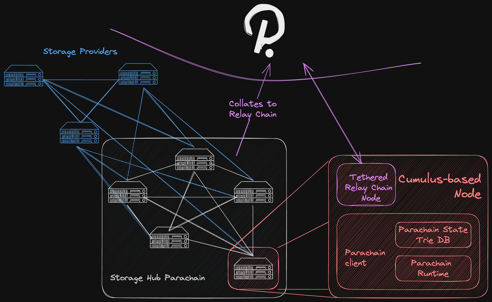

# 🐘 Big Files
**Definition of big files** would be everything that cannot be transfer via XCM or input through an extrinsic. Generally speaking, images, documents, audio and general media files would be considered big files. Depending on who the main user ends up being - other parachains or relay chain through XCM, or an end user sending transactions to this parachain directly - one of the two criteria would be more fitting.
## Requirements
1. Most likely that storage should be off-chain.
2. We need storage providers to prove that they are actually storing data.
3. Redundancy of storage (as any node can go offline any time).

# Dilemmas
## Off-chain storage
For this type of storage, we would need it to be off-chain to support large files.
Given that off-chain storage would still require an on-chain component, off-chain storage can actually be thought of as a superset of on-chain storage.



For simplicity's sake, lets consider that the parachain runtime has a Storage Pallet with an array of storage elements, which can be a structured as follows:

```rust
struct StorageElement {
	id: StorageId,
	hash: Hash,
	permissions: BoundedVec<Permissions>,
	...
	data: StorageData
}

enum StorageData {
	/// A byte array of the raw data, for small size files stored on-chain.
	BoundedVec<u8>,
	/// A reference to the data stored off-chain by a Storage Provider.
	StorageRef,
}
```

### Proofs ✅: How storage is proven?
1. zk-SNARKs like Filecoin? Complex, likely long development time, but optimal.
	1. *Should the zk-SNARK be validated in the WASM runtime or as a Host Function (potential problem with Polkadot Validator nodes)?* Most likely in the WASM runtime.
3. Hashes of content like Greenfield? Easier, but requires network traffic of the content, long computing for validators and actually sharing the content with the validators; sub-optimal.
4. Other?

### Proofs ✅: Where should proofs be stored? 
1. Almost 100% sure in the Storage Hub parachain, but...
2. Depending on the Game Theory and how proofs are requested/challenged, the proofs might be stored data on-chain (i.e. part of the state trie) or an argument of an extrinsic that performs the validation.
3. The latter (as part of an extrinsic, basically data of a block) is very much preferred, specially if the Game Theory leads the design to post storage proofs regularly.

### Proofs ✅: How often do we challenge proofs?
1. Filecoin does it every 24 hours or every time a node produces a block.
2. Greenfield allows for anyone to submit a challenge, and also performs periodic challenges, but does not specify frequency ([see here](https://docs.bnbchain.org/greenfield-docs/docs/guide/greenfield-blockchain/modules/data-availability-challenge#challenge-heartbeat)).
3. If [Locked DOT](#^c64721) is chosen, Storage Providers could be required to provide on-chain proofs for claiming staking rewards. This could reduce the overhead chain cost of periodically demanding proofs.

### Game Theory 🕹️: How to incentivise Storage Providers to keep data in hot storage?
Storage Providers should have the stored data readily accessible (hot storage), and that's what proof challenges are for.
1. **Punishment**. Easiest form of incentive. Storage Providers are regularly or arbitrarily challenged to provide proofs they're still storing the data, and otherwise they're punished (slashed). To prevent speculation, the challenges have to be frequent and random, so that Storage Providers are coerced to have all files in hot storage. Filecoin and Greenfield have such incentives.
2. **Reward**. Positive incentives are usually more effective than negative incentives, and prevent adding attack vectors. Storage Providers could be rewarded for retrieving in time the data they're supposed to be storing. 
	1. This would mean reading data stored off-chain is not free.
	2. Filecoin has a retrieval fee, but then there are project which expose Filecoin stored files through IPFS, making it free...
3. A combination of the two is also possible and likely desirable.

### Game Theory 🕹️: How are Storage Providers compensated for their service?
1. Filecoin has an open market of settlements where user and Storage Provider agree on a price in FIL to pay for a given amount of storage, for a given amount of time. Fair, but introduces the user complexity of having to renew the settlements.
2. Arweave determines a price for perpetual storage at the protocol level. Good user experience (pay once, store forever) but clean up is not incentivised, resulting in bloating.
3. Greenfield leaves it up to each Storage Provider to put its price and gain reputation, so the user makes an arrangement directly with Storage Provider.
4. **Locked DOT**: leveraging the fact that this would be a system parachain, a model could be implemented in which users lock `X` DOT for `Y` MB of data, and get those same `X` DOT back as soon as they free the storage space. While the DOT is locked, the file should be securely stored.  ^c64721
	1. The price to pay is the opportunity cost and DOT's inflation.
	2. The incentive for the Storage Provider would be programming some logic in the runtime so that those `X` DOT are staked and the Storage Provider can claim the staking rewards.

### User Experience 🧑🏻‍💻: How expose should the underlying network of Storage Providers be?
In other words, should the user be exposed to selecting the Storage Provider they want to use? Or should that be decided by the network/protocol?
1. Leaving the choice up to the user would mean also exposing them to choose which providers are actually storing their files. It is an easier approach in terms of protocol design, but a poorer user experience. Another downside is a potential centralisation vector if all users start choosing the most reputable Storage Provider, or because of a default option in the most used dapp.
2. Having the protocol automatically allocate resources provides a better user experience, but a greater design effort.
3. The automatic allocation of storage can be later built as a layer on top. So in principle, leaving the choice up to the user seems more attractive for a first version.

### User Experience 🧑🏻‍💻: How is storage price calculated?
Depends greatly on [Game Theory 🕹️](bigFilesDilemmas.md#Game%20Theory%20🕹️%20How%20are%20Storage%20Providers%20compensated%20for%20their%20service?).

### User Experience 🧑🏻‍💻: Is the level of redundancy exposed to the user's choice?
Same as before, giving the choice to the user is detrimental to the user experience, but it is an abstraction that could be added with a layer on top. On the other hand, though, there could be interest of some users in paying more for a higher level of security of their data.

### User Experience 🧑🏻‍💻: Is the level of latency exposed to the user's choice?
Same as with redundancy, some users could want to pay more for more restricted / mission critical use cases. For example, if Validator nodes of the Relay Chain are storing runtime source code for applications that do not have a slot/core dedicated (not regular parachains, just applications that occasionally require coretime) in the StorageHub, they could be interested in paying higher fees for a guarantee of retrieval time of `X` ms with a confidence of `Y` %.

### Protocol 🏛️: How the metadata stored on-chain looks like? Do we have some restriction on this?
It should be pointed out that *how* the data is stored on-chain depends greatly on other design choices, including proofs (how they are implemented and how often they're requested), data availability and Game Theory (incentives).
1. Things probably worth storing (regardless of *how* they are stored):
	1. Hash of the data.
	2. ID of the data (if different than hash).
	3. Permissions given for accessing that data.
	4. Actual data / reference to locate the data stored off-chain.
	5. Proof related data.
2. The permissions don't need to be stored literally as part of the state trie data, if, for example, a solution like the one proposed [here](bigFilesDilemmas.md#^4fb27d) is implemented.
3. Depending on the frequency in which proofs are required, storing them as block data (for instance as arguments of extrinsics) would be preferable.
4. A most efficient solution in terms of on-chain storage (in the state trie), would only need to store:
	1. ID of the data.
	2. Reference to locate the data stored off-chain (for example, using a DHT).
	3. `AccountId` owner of the data.
	4. The last time/block that a proof was verified for a given data or Storage Provider.

### Protocol 🏛️: What information is sent over XCM? How does it triggers upload/retrieval of data?
For every storage operation that involves some kind of on-chain payment, since the data exchange should happen off-chain, the process would involve 3 steps:
1. User requests storage service on-chain through XCM message, and places funds temporarily on hold.
2. Storage Provider receives message, opens off-chain channel for exchanging data, and stores it.
3. Storage provider generates proof that the data has been stored, posts it on-chain to release funds placed on hold by the user.
This process involves 2 transactions and is therefore costly and slow. If taken the appropriate security measures, the "settlement" (first step) could be done off-chain also, so that only the last transaction remains. For instance, if the user provides a signed message that they commit to pay `X` amount of DOT for the service, then the transaction in step 3 can verify both the signature of the user, and the storage proof of the Storage Provider. But, in this case for example, the process should be guarded against replay attacks of malicious Storage Providers who could try to re-use a user's signature.

### Protocol 🏛️: How the data retrieval is handle? Who pays for that?
1. From Filecoin we have [Filecoin retrieval market](https://docs.filecoin.io/basics/what-is-filecoin/retrieval-market)

### Protocol 🏛️: How we should manage redundancy?
1. In Greenfield’s model there is one Primary Storage Provider and 4+2 Secondary Storage Providers with Read-Solomon erasure coding.

### Protocol 🏛️: How do we manage permissions?
1. Assigning an `AccountId` owner of a storage element and having that `AccountId` use the [Proxy Pallet](https://github.com/paritytech/polkadot-sdk/blob/master/substrate/frame/proxy/README.md) to assign permissions to other accounts.  ^4fb27d

### Networking 🕸️: How do parachains / applications send data blobs (files) to Storage Provider? 
1. Storage Providers could provide an endpoint to send the file to. But in that case, aren’t we going back to making the dApp have to deal with the blockchain on one side, and the Storage Provider on the other? When what we wanted was to make the dApp forget about storage management when using a Polkadot app that under the hood integrates with the Storage Hub.
2. Peer to peer communication using `libp2p` would be a good alternative when the data is being transferred from an external parachain or Relay Chain node, to a Storage Provider node. 
	1. *But what if the data is coming directly from the user's application?* In that case, a module could be provided for parachains who want to integrate our solution, to provide an RPC method in their nodes to interact with the Storage Provider.

### Networking 🕸️: How do Storage Providers return a given content/file upon request?
1. Storage Providers could expose an endpoint to request some content to be served off-chain. If content is permissioned, the storage provider should request in it’s endpoint something like a signature proving that whoever is requesting the file, has ownership of the corresponding permission token.
2. Peer to peer communication is subject to the same restrictions as above.