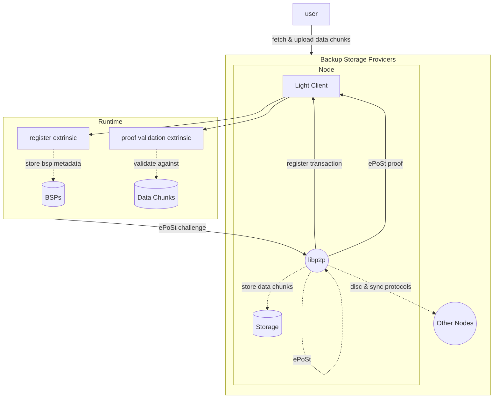
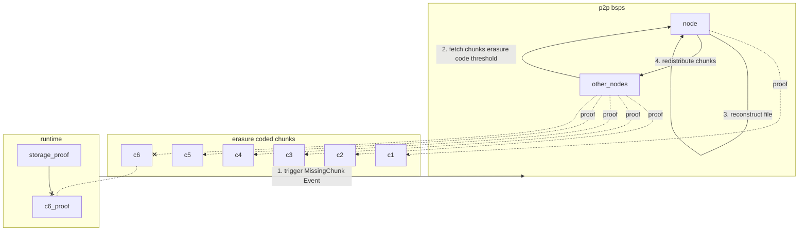

# Distributed p2p BSP Nodes

Distributed p2p BSP (Backup Storage Provider) nodes store and serve data, off loading the StorageHub runtime from managing, tracking and distributing data efficiently and redundantly. The BSP nodes will utilize many components to provide these guarantees which are described briefly in the **Terminology** section.

## Terminology

**libp2p**: Peer to peer modular network stack. Our proof of concept would be based on the [rust-libp2p](https://github.com/libp2p/rust-libp2p) implementation of this spec.

**Erasure Coding**: Data redundant and scalable methods of splitting a file into encoded chunks of data which enables the reconstruction of the original file with only a subset of chunks.

**Proof of Storage** (also **proof of retrievability**, **proof of data possession**): Proving to runtime/users that the data is stored without having to download the file. This can be in the form of Merkle proofs but has been implemented in some form by Chives, Storj, Sia, [Filecoin](https://en.wikipedia.org/wiki/Filecoin), and Arweave.

**Proof of Storage-Time**: Proofs of storing data over a period of time. This would be ideal for providing a guarantee to the users that their data is being stored and is available at any given point in time.

**Distributed Hash Table (DHT) & [Kademlia](https://www.notion.so/Proposal-Text-09c611010ee642149f8d1dc08ef63358?pvs=21)**: Kademlia is a peer and content discovery protocol based on DHT. All peer addresses are hashes of their public key and are addressed as [Multiaddresses](https://docs.libp2p.io/concepts/appendix/glossary/#multiaddr) which defined the protocol layers a node supports to establish p2p communication. Content stored in the network is hashed and addressed as [Multihashes](https://docs.libp2p.io/concepts/appendix/glossary/#multihash) which enables different hashing algorithms to be introduced without comprising any previous utilized hashed content.

**[Bitswap](https://docs.ipfs.tech/concepts/bitswap/) & [SNIPS](https://arxiv.org/abs/2304.04891) (& others)**: Data exchange/synchronization protocols. These protocols would enable BSP nodes to communicate and transmit data chunks in an efficient and redundant manner.

## Proposal

### Architecture



### BSP Node Specification

BSP nodes will need to support the following protocols and features. Part of the StorageHub deliverable would be to develop a public production ready rust node so we can onboard the community more efficiently with a low barrier of entry.

Features & protocols to include in node:

- rust-libp2p
  - Discovery protocol (DHT & Kademlia) 
  - Data synchronization protocol (SNIPS or Bitswap)
- Light Client (Smoldot)
  - Account registration with libp2p keys
  - Event listeners:
    - `RequestStorage` (new chunks to be uploaded to the network)
    - `MissingChunk` (no proofs were submitted for a chunk)
    - `ChunkThresholdNotMet` (not enough proofs for given chunk)
  - Transaction submission
- File reconstruction mechanism and chunk redistribution.
- ePoSt implementation to prove chunk storage over given time frame

### Data Chunks

Steps for pre processing a file on the client side would include:

- Encrypting the file (optional)
- Dividing/merkalizing the file in erasure coded chunks
- Pre-process (ePoSt.Store) each chunk

To support large files, a file is initially hashed and divided into *N* erasure coded chunks (merkalized) by the User. The size of each chunk is determined by the maximum size it can hold, which is based on the data synchronization layer (Bitswap, SNIPS, etc.) and the proof generation algorithms (ePoSt). 

### Joining the network

To mitigate the occurence of sybil attacks, nodes who wish to register as a BSP will need to **lock a considerable amount of DOT** and **lock addtional DOT based on the amount of chunks/data size** they are storing/proving.

BSP nodes are considered part of a global distributed p2p network. The runtime does not impose a upper bound limit on the number of BSP nodes registered since doing so would only reduce data redundancy and availability.

### **ePoSt: Practical and Client-Friendly Proof of Storage-Time**

**Key points:**

- Secure, stateless and efficient Proof of Storage-Time protocol with public verifiability.
- Ensures continuous data availability and minimizes the cost of the client, which is crucial for real-world deployment. Specifically, **processing a 1GB file for outsourcing**, in anticipation for 3 proof/verify interactions, each **attesting a period of 1 year at 25 minutes intervals requires only 66.34 minutes**.
- Proof size and verification remains at a reasonable cost: **a proof is of size 48.82KB, and can be verified in 36.05 ms**
- It is **publicly verifiable** which allows the data owner to outsource the verification process
- It is stateless which allows **unlimited number of proofs and verification to be conducted** after the file has been stored.
- **Implemented in Rust** and utilizes zk-SNARKS (tweaked)


#### In Practice (high level)

At the time of uploading a file, the user can determine for how long they wish to store the file, the proof generation frequency (VDF *T* parameter) and if it is renewed after that period. This will cause the StorageHub runtime to trigger a challenge for for each data chunk and the BSP nodes will continously execute RoundEvals on the chunks he has for proof of storage-time.

Because data chunks are replicated amongs BSP nodes, there will be multiple submitted ePoSt proofs for a single challenge. (This will have to be reviewed based on the ePoSt algorithms)

**Limitation of Filecoin Proof of Storage-Time:**

The limitation of this protocol they run PoS periodically and so a powerful prover may “loaf on the job” (*e.g.*, outsource the data to an inferior storage provider after quickly generating a valid proof, and retrieve it upon the next challenge), thus the continuous availability cannot really be ensured.

### Runtime

#### `pallet_storage`

High level pallet interface, storage and types. (non exhaustive)

```rust
/// Represents the addressing information to connect to MSP or BSP nodes.
///
/// More information on multiaddr
/// https://docs.libp2p.io/concepts/appendix/glossary/#multiaddr
type Multiaddr = Vec<u8>
/// Type alias over hashing output type
type Hash = <BlakeTwo256 as Hash>::Output;

/// All information needed for a given file
struct File {
  /// The Main Storage Provider that is storing and serving this data
  msp: Multiaddr,
  /// User defined file identifier
  ///
  /// Files are stored under a prefix (the account's address)
  identifier: String,
  /// Hash of the file content
  content_hash: Hash,
  /// Merkle root of merkalized file (the file is initially merkalized and divided into erasure coded chunks)
  root_hash: Hash,
  /// Array of erasure coded chunks for this file.
  ///
  /// In order by leaf nodes.
  chunks: BoundedVec<Chunk>,
  /// Minimum number of chunks required to reconstruct the file
  reconstruction_threshold: u16
}

/// Erasure coded chunks of data originating from a file
/// 
/// This is what is stored in the BSP p2p network.
struct Chunk {
  /// Merkle leaf node index
  index: u16,
  /// This represents data addressed by a multihash. 
  /// Future proofing this identifier to allow changing content hashing algorithms would be trivial.
  ///
  /// Expected to use something like rust-multihash crate which supports no-std environment.
  /// https://github.com/multiformats/rust-multihash
  ///
  /// More information on multihashes.
  /// https://docs.libp2p.io/concepts/appendix/glossary/#multihash
  /// https://github.com/multiformats/multihash
  hash: Multihash,
  /// Proofs submitted by BSPs
  proofs: BoundedVec<(AccountId, Hash)>,
  /// Size of the data chunk (KB or MB?)
  size: u16
}

/// A proof submitted for a given [`Chunk`]
struct Proof {
	/// BSP node that submitted the proof
	bsp: AccountId,
	/// AGG (aggregated proof) hash (ePoSt: Proof of Storage-time)
	proof: Hash
}

/// Storage Provider metadata
struct SPMetadata {
	/// p2p address
	multiaddr: Multiaddr,
	/// Submitted proofs for chunks (chunk hash, proof hash)
	proofs: BoundedVec<(Multihash, Hash)>
}

/// List of file hashes with their corresponding chunks
#[pallet::storage]
type FileStore = StorageMap<blake2_128_concat, Hash, BoundedVec<Chunks>>
/// All Chunks uploaded to StorageHub
#[pallet::storage]
type DataStore = StorageMap<blake2_128_concat, Chunks, Metadata>
/// List of Chunks owned by specific AccountIds
#[pallet::storage]
type AccountData = StorageMap<blake2_128_concat, AccountId, BoundedVec<Chunks>>
/// Registered Main Storage Providers
#[pallet::storage]
type Msps = StorageMap<blake2_128_concat, AccountId, SPMetadata>
/// Registered Backup Storage Providers
#[pallet::storage]
type Bsps = StorageMap<blake2_128_concat, AccountId, SPMetadata>

#[pallet::event]
#[pallet::generate_deposit(pub(super) fn deposit_event)]
pub enum Event<T: Config> {
	/// Notify BSP network of new request to store chunks (all chunks for given file)
	RequestStore {
    		/// Address to connect to for requesting data
		user: Multiaddr,
		/// Chunks to be uploaded to the network (index, hash, size)
		chunks: BoundedVec<(u16, Multihash, u16)>
	},
	/// No proofs were submitted for given chunk
	///
	/// BSP network should reconstruct files for each missing chunk
	/// and redistribute them.
	MissingChunks {
		/// Could send the file identifier for each missing chunk
		/// along with the required chunks for reconstruction
		chunks: BoundedVec<MultiHash>
	},
	/// Threshold of proofs not met for given chunks
	///
	/// BSP network should correct this by requesting and replicating the data
	/// from the other nodes in the network
	ChunksThresholdNotMet {
		chunks: BoundedVec<Multihash>
	}
}

#[frame_support::pallet]
pub mod pallet {
	/// A reason for this pallet placing a hold on funds.
	#[pallet::composite_enum]
	pub enum HoldReason {
		/// The funds are held as deposit for the used storage.
		StorageFeeHold,
	}

	#[pallet::config]
	pub trait Config: frame_system::Config {
		/// The overarching event type.
		type RuntimeEvent: From<Event<Self>> + IsType<<Self as frame_system::Config>::RuntimeEvent>;
		/// A dispatchable call.
		type RuntimeCall: Parameter
			+ Dispatchable<RuntimeOrigin = Self::RuntimeOrigin>
			+ GetDispatchInfo
			+ From<frame_system::Call<Self>>;
		/// The fungible type for this pallet.
		type Currency: FnMutate<Self::AccountId>
			+ FnMutateHold<Self::AccountId, Reason = Self::RuntimeHoldReason>
			+ FnBalanced<Self::AccountId>;
		/// The overarching runtime hold reason.
		type RuntimeHoldReason: From<HoldReason>;
		/// Weight information for extrinsics in this pallet.
		type WeightInfo: WeightInfo;
	}

	/// Request to store file along with chunks
	#[pallet::call_index(0)]
	pub fn request_store(origin: OriginFor<T>, file: File) -> DispatchResult { }

    	/// Register as BSP node
	#[pallet::call_index(1)]
	pub fn register_as_bsp(origin: OriginFor<T>) -> DispatchResult { }
  
	/// MSP extrinsic to prove data storage of a chunk
	///
	/// Based on ePoSt (Proof of Storage-time)
	#[pallet::call_index(2)]
	pub fn proof_of_storage(origin: OriginFor<T>, chunk: Multihash, agg_proof: Hash) -> DispatchResult { }
}
```

### Incentivization

#### Define target thresholds for data redundancy and availability

- Set a **minimum amount of data chunks per BSP node to be considered an active participant**. This is calculated as a ratio based on the total number of chunks in the network.
- Establish a **minimum number of valid proofs required per chunk per epoch**. This is also calculated as a ratio based on the total number of data chunks for a given file and the erasure coded reconstruction threshold.

To implement this, the runtime needs to store the number of valid proofs and the BSP nodes that submitted them for each chunk. It should also flag any chunks that do not meet the target threshold parameters. 
    
These flags would be triggered as events for the BSP network to listen to and correct the issue by requesting the data chunks from the network for replication.

#### Reward and Penalization Schemes

***Rewards and Data integrity***

Data chunks will have a reward multiplier based on the amount of proofs received by BSP nodes. In the scenario where a chunk is only proven to be stored by a single BSP, we need to incentivize other BSPs to replicate and start storing this chunk to increase data redundancy and availability.

In essence, the less a chunk is replicated and available, the more reward is associated with it.
  
***Slashing and Reputation***

Failure to increase the threshold for a given chunk after so many epochs, would reduce the rewards globally. This is to punish the network as whole and to incentivize them to take into considerations all chunks in the network as a necessity.

Slashing comes into play when invalid proofs are submitted to the runtime. By default all BSP nodes who join the network can store as much data as they want (up to the maximum limit of storage space, declared during registration) provided they lock the appropriate amount of DOT. But when they get slashed, a data storage limit will be applied to reduce the affect of a missbehaving node. Almost like a reputation scheme.

Succesffuly participating in the network increases your reputation up to the max once again. But at some point, if a BSP node keeps getting slashed, they will be removed as a registered BSP node, and all their DOT will have been slashed. 

Attempting to perform sybil attacks should be hard to accomplish due to the locking and slashing DOT schemes.

*What happens if the BSP node needs to shutdown for maintenance purposes. What if it happens during proof submission period? What happens with Proof of Storage-Time?*

### Chunk Recovery Mechanism

If no proofs are received for a specific chunk, but we still have the minimum number of chunks required to reconstruct the file (using erasure coding), an event is triggered. A BSP node will then request all the data chunks needed to reconstruct that file and redistribute the missing chunks in the network to ensure that all chunks are potentially available.

Other nodes receiving the missing chunks of data can easily verify the data by querying the runtime storage and validating that hashing the chunk of data results in one of the hashes that are missing for that file.

The following diagram represents the high level steps for chunk recovery:

1. Runtime triggers `MissingChunk` event
2. BSP nodes listen to this event and request minimum amount of chunks required based on erasure coding threshold for given file
3. Reconstruct file
4. Redistribute all file chunks to the rest of the network



---

### Pros

- Off load runtime from managing, tracking and distributing data amongst BSP nodes
  - Minimized network traffic between runtime and BSPs (events are triggered to notifiy network as a whole)
  - Only a single node needs to download a chunk from the client since the data will be synchronized automatically to other nodes.
  - Minimized storage, storing data chunks along with proofs and who submitted them (proof data is ephemeral and would be removed after certain amount of time has passed).
- Increased data redundancy and availability due to the distributed nature of the p2p network
  - No limit of replicated data chunks amongst nodes in the network. No need to track proofs per BSP node, thererfore no increase in data storage in the runtime.
- Improved scalability.
  - Potentially no upper bound limit of the amount of nodes in the network
  - No data chunk storage limitation for nodes. Only constrained by their own hardware.
- Proof of Storage-Time (ePoSt) guarantees PDP (Provable Data Possession) and PoR (Proof of Retrievability) within a certain time frame.
- Nodes joining and leaving the network does not require any coordination with the runtime when it comes to data chunk re-synchronization.

### Cons

- Time and effort required to develop a production-ready node with a suite of protocols and features, including network and data synchronization protocols (ePost non-trivial)
- Would require potentially good hardware to support network and computation (what about TEE?)
- Extensive research on incentivization and penalization schemes to guide the network on a global scale (like ideal staking rate: https://forum.polkadot.network/t/adjusting-the-current-inflation-model-to-sustain-treasury-inflow/3301)
- Potential unforeseen attack vectors
