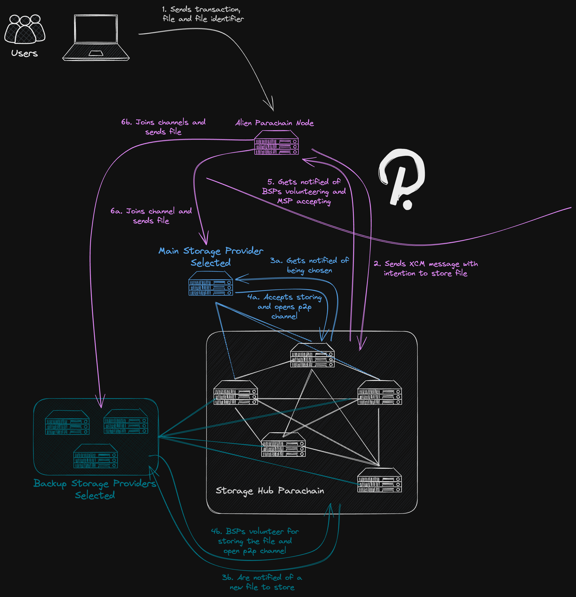
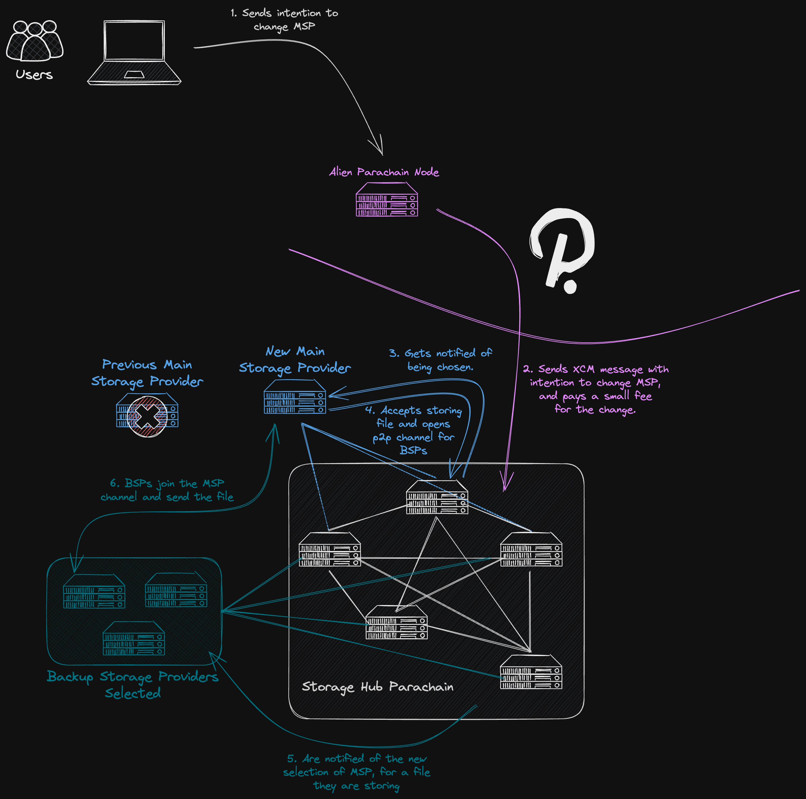
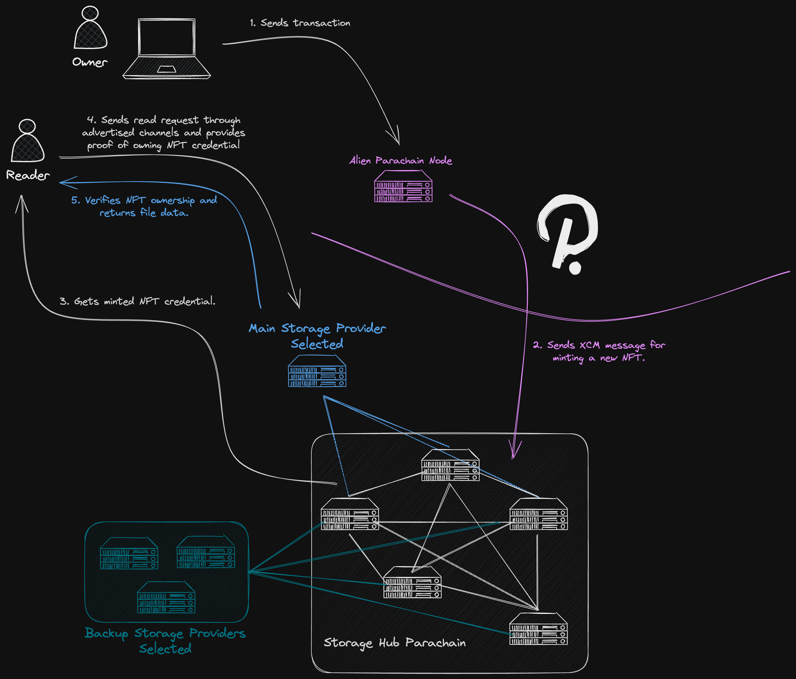

# Modules Breakdown
This document refers to the modules needed to implement StorageHub, for each of the functionalities in the system. Some of those modules are considered strictly necessary for even the most basic implementation of StorageHub, and other would greatly improve its adoption, but can be added in future versions, or even be developed by other teams.

The document is broken down into the different user stories that can take place in the system, followed by the list of modules that would need to be implemented to make those stories possible.
1. User writes a file to StorageHub.
2. User overwrites a file to StorageHub.
3. User changes Main Storage Provider.
4. User reads file from Main Storage Provider.
5. User updates permissions for reading a file it owns.
6. User updates permissions for writing a file it owns.
7. User "deletes" file (stops paying for its storage).
8. Main Storage Provider advertises its service in StorageHub.
9. Main Storage Provider delists its services from StorageHub.
10. Backup Storage Provider signs up to provide storage capacity to StorageHub.
11. Backup Storage Provider removes itself from StorageHub.
12. Storage Provider increases its stake to provide more storage capacity to StorageHub.

### Terminology
- Alien Parachain: a parachain part of Polkadot's ecosystem that is not StorageHub.
- MSP: Main Storage Provider.
- BSP: Backup Storage Provider.
- SP: Storage Provider (refers to both Main and Backup).
- Fingerprint: a cryptographic output that uniquely identifies the contents of a file, like a hash or a Merkle root. The file itself is identified by its location and that cannot change (moving the file is like deleting that one and creating another), but the content of the file can change, and therefore so its fingerprint

# Writing a File
The default -and most likely simplest- approach an alien parachain could take to interact with StorageHub, is one where a node from that parachain would be using XCM to communicate to StorageHub the intention of storing a file. That message should have:
- File owner.
- File location.
- Fingerprint (hash or Merkle root).
- Size of data.
- Main Storage Provider selected.
- Connection multiaddresses for Storage Providers to connect with the node and receive a file.

Sending the XCM message initiates the process of the file upload. After sending the message, the alien node would monitor StorageHub's chain until it sees the corresponding transaction pass. Storage Providers also monitor on-chain activity, and react to this transaction accordingly, depending on whether they are Main or Backup Providers. In the case of Main Storage Providers, they respond on-chain with a transaction accepting the storage request. As for Backup Providers, they also monitor every storage request and can volunteer to store a copy of a file, as soon as they meet the selection criteria. For more information on how a Backup Storage Provider qualifies for a file, read [File System Pallet](runtimeBreakdown.md#File-System-Pallet). In both cases, Main and Backup Storage Providers, they open peer-to-peer channels and include the alien parachain node's [multiaddress](https://docs.rs/fluence-fork-libp2p/latest/libp2p/#multiaddr) in their Access Control List. The process ends with the alien parachain node monitoring the transactions on StorageHub to find out about the Main Storage Provider accepting, and Backup Storage Providers volunteering.



The alien node would receive from the user a file, the fingerprint (hash or Merkle root), and potentially a signed transaction that the user wants to execute in that parachain. To keep the system trustless, the user would have to compute the fingerprint locally, and this could limit scalability. Based on proofs of concept carried out by our team, with JavaScript code and little to no optimisations, a decent computer should handle merklising a file of ~1GB in ~5 seconds. Therefore the scalability limitations are acceptable unless the user wants to upload hundreds or thousands of files like images, all at once (which could be the case for a user uploading an NFT collection).

Aside from the trustlessness, if the user couples the file upload with a transaction in the alien parachain, if that transaction takes the fingerprint as an argument, the user would be forced to compute locally, otherwise it wouldn't be able to sign the transaction without knowing the argument beforehand.

Nonetheless, decisions like this are not strictly the territory of StorageHub, but that of the alien parachain and how this one exposes the services of StorageHub to its users. The parachain could even opt for a light client implementation, and transferring absolutely all of the processing and networking burden to the users' hardware. 

The scope of this document is to explore what StorageHub should provide to alien parachains to ease that process. That is why these workflows and alternatives are considered and discussed.

On a final note about this process, it can be seen that the whole protocol for a file upload could take considerably more time than what a user is used to in traditional cloud storage services. Normally, end users expect wait times in the order of seconds for uploading a single file, and having it readily available. However in StorageHub, the back and forth of transactions alone, especially if the system waits for finalised transactions, could take several minutes. To improve this poor UX, it is expected that some Main Storage Providers could offer an optimistic upload. This would consist in the Main Storage Provider accepting a user's file and having it instantly retrievable, with very little certainties, like a signed transaction. Then in the background, the system would provide the reliability and unstoppability of Backup Storage Providers, in due time.
## Mandatory Modules
Refers to the modules that are essential for a very first implementation of StorageHub, and which cannot be implemented by other teams or parachains themselves.
### File Transfer Module (p2p)
A Rust crate that should expose a set of asynchronous tasks. The module would use [rust-libp2p](https://github.com/libp2p/rust-libp2p) and its [multiaddresses](https://docs.rs/fluence-fork-libp2p/latest/libp2p/#multiaddr) for connecting the alien parachain node with the assigned Storage Providers.
1. **Sending a file**: this task is used by an alien parachain node to send the file to both MSPs and BSPs, through peer-to-peer channels opened by them.
	1. It monitors the on-chain activity in StorageHub with the help of the [StorageHub Light Client](modulesBreakdown.md#Storage%20Hub%20Light%20Client), until it detects an event of either an MSP accepting the storage request, or a BSP volunteering for storing a copy of the file. From the event, the  [multiaddress](https://docs.rs/fluence-fork-libp2p/latest/libp2p/#multiaddr) of the Storage Provider is extracted.
	2. For each Storage Provider detected, a connection is established with a configured amount of re-attempts in case of failure, and the file is sent in case of success.
	3. The task can be configured with a timeout in case not all the expected Storage Providers show up.
2. **MSP receiving a file**: this task is used by a Main Storage Provider to open up a peer-to-peer channel, with an Access Control List only allowing the alien parachain node to connect and send the file.
	1. It is configured with the Main Storage Provider ID to pay attention to.
	2. Monitors the on-chain activity in StorageHub with the help of the [StorageHub Light Client](modulesBreakdown.md#Storage%20Hub%20Light%20Client), until it detects that the configured MSP was selected for a file.
	3. The default behaviour of the implementation would be to accept the request, and send the corresponding transaction to StorageHub. But the MSP can modify it if it chooses not to accept some requests at will.
	4. A peer-to-peer channel is opened with the MSP's [multiaddress](https://docs.rs/fluence-fork-libp2p/latest/libp2p/#multiaddr) and an ACL allowing no one to connect but the [multiaddress](https://docs.rs/fluence-fork-libp2p/latest/libp2p/#multiaddr) specified in the storage request, which should have the file.
	7. Awaits for the alien parachain node to connect and receives the file. The maximum waiting time can be configured.
3. **BSP receiving a file**: this task is used by a Backup Storage Provider to open up a peer-to-peer channel, with an Access Control List only allowing the alien parachain node to connect and send the file.
	1. It is configured with the Backup Storage Provider ID to use to determine if/when this BSP qualifies for storing a file.
	2. Monitors the on-chain activity in StorageHub with the help of the [StorageHub Light Client](modulesBreakdown.md#Storage%20Hub%20Light%20Client), until it detects a new storage request.
	3. Checks the criteria for qualifying for storing that file, and schedules a task for when the criteria is going to be true.
		1. The schedule task starts by checking if the file still requires Backup Storage Providers. If that is still the case, it proceeds to send a transaction volunteering to store the file.
		2. A peer-to-peer channel is opened with the BSP's [multiaddress](https://docs.rs/fluence-fork-libp2p/latest/libp2p/#multiaddr) and an ACL allowing no one to connect but the [multiaddress](https://docs.rs/fluence-fork-libp2p/latest/libp2p/#multiaddr) specified in the storage request, or any of the other Storage Providers already registered for that file.
		3. Awaits for a connection and receives the file. The maximum waiting time can be configured.
4. **SP task for charging**: to reduce the cost of transactions, payments might not be executed in the same transaction in which the storage proof is submitted. In that case, Storage Providers should be given a task to frequently (but less frequently than the proofs submission), cash all the earnings for the submitted proofs, since the last time it charged for its services.
5. **SP task for deleted files**: a task to watch for deleted files, so that the Storage Provider can clear its storage.

For the actual transfer of the file, libp2p is flexible and configurable to set a file transfer logic. The following protocols are considered for this implementation:
1. **Request-Response Protocol**: simple and straightforward protocol where the sender can send a file as a response to a request from the receiver. libp2p comes with an implementation of `RequestResponse` protocol out of the box. It allows for a simple request-response pattern which is suitable for sending files or data blobs.
2. **Bitswap**: more suitable for larger files that need to be broken into chunks. It's a block exchange protocol used by IPFS that's designed for efficient data transfer. It breaks files into blocks and uses a credit system to incentivise peers to share blocks with each other. It should be reviewed whether this incentives system is compatible with our more simple approach.
3. **GraphSync**: An extension of Bitswap that allows for the transfer of arbitrary graphs of linked data. More suitable if the data to be transferred is part of a larger dataset with complex relationships. GraphSync achieves better efficiency by only sending the parts of data that are needed. Most likely too complex for our specific needs.
### StorageHub Light Client
In its simplest form, it should be capable of:
1. Connecting to StorageHub parachain and synchronising to latest finalised block.
2. Downloading the list of transactions from the latest finalised blocks.
3. Verifying the list of transactions from the latest finalised blocks.
4. Filtering transactions and events in transactions.
5. Signing and sending transactions to StorageHub.

This module can be built on top of the tools provided by [subxt](https://github.com/paritytech/subxt).
## Optional Modules
Refers to modules that would greatly benefit StorageHub by making the life of other parachains or participants in the system easier, but can technically be implemented by other teams in their own ways and flavours.
### Pallet for Submitting Storage Requests
Submitting a storage request from an alien parachain to StorageHub can be done building the appropriate XCM message. Such message would look something like this:
```rust
let message = Xcm(vec![ 
	WithdrawAsset( ... ), // Get assets to pay for execution.
	BuyExecution { ... }, // Buy execution for transaction.
	Transact { ... }, // Run transaction for requesting storage.
	RefundSurplus, // Refund surplus of BuyExecution if there is any.
	DepositAsset { ... }, // Deposit the surplus back in the user's account.
]);
```

The key part happens in `Transact`, where the transaction that processes the storage request and assigns the Storage Providers, gets executed.

Parachains interacting with StorageHub can be required to build their XCM messages accordingly. But besides providing a poor developer experience, this would be prone to creating bugs down the line, if StorageHub changes the way it expects the XCM message to be. That is why it would be beneficial for StorageHub to provide a **pallet** that abstracts over the creation of such XCM messages.
### Client Running Merkle Tree Generator
As mentioned above, for trustlessness and practical reasons, users might be required to merklise or hash their files locally, before sending them to the alien parachain node. To make sure there are no issues in this process, for example building the Merkle tree in a different order, using the wrong hashing algorithm or the wrong hash length, it should be considered providing a web-friendly package to abstract dApp builders of this considerations.

The package would consist of a series of functions and tools that build the information StorageHub needs for storing a file, in the appropriate way, in a handful of lines of code.
## Library for Separating File into Chunks
As previously mentioned, to prevent damaging severely the user experience, the computational burden of separating the file into chunks, applying Erasure Coding, and computing the fingerprint for each set of chunks, will be placed on the alien node. Thus, the node becomes a trusted party in this particular part of the process. To avoid errors in parachain nodes implementations of this process, and therefore damaging the trust in StorageHub as a whole, it is strongly suggested that a library for executing this process should be provided.
### Library for Adding RPC Method to Node
It is also considered providing a library for parachain node developers, to facilitate them adding an RPC method that receives a transaction paired with a file to store in StorageHub, and handles both the file upload and sending the transaction. This is one of the most uncertain modules as it strongly depends on each parachain's implementation and interface it provides to their users. However, there could be a standardise or suggested approach.
# Overwriting a File
Follows the same workflow as writing a file for the first time, except that the XCM message now executes a different extrinsic. This XCM message should have:
- File owner.
- File location (for identifying the file to overwrite).
- New fingerprint (hash or Merkle root).
- New size of data.
- Main Storage Provider selected (optional, can be the same)
- Connection multiaddresses for Storage Providers to connect with the node and receive a file.

Other than that, the actions and modules needed remain the same.
# Changing Main Storage Provider
Changing a Main Storage Provider implies that the user owner of the corresponding file, sends a transaction (or XCM message that executes a transaction) requesting the change on-chain. The new Main Storage Provider, after accepting the assignment on-chain with a transaction, opens a peer-to-peer channel with an ACL allowing the assigned Backup Storage Providers to connect. Backup Storage Providers assigned to that file should be aware of such change and react by attempting to connect to the new Main Storage Provider. They would know the [multiaddress](https://docs.rs/fluence-fork-libp2p/latest/libp2p/#multiaddr) of the Main Provider, as it would be registered on-chain before hand. The Backup Storage Providers then initiate the transfer of data. From this point on, the system resumes operations as usual.



Backup Storage Providers are meant to be implemented with hardware requirements as low as possible, especially when it comes to networking. That is what assures decentralisation and unstoppability for the system. Honest users would normally try to avoid changing a Main Storage Provider, but dishonest ones might be interested in attacking the system by stressing the networking capabilities of Backup Storage Providers. It is therefore proposed to impose a fee for changing Main Storage Providers, that should be high enough to deter such an attack, but at the same time low enough so that it is still permissionless to change from one Main Storage Provider to another.
## Mandatory Modules
Refers to the modules that are essential for a very first implementation of StorageHub, and which cannot be implemented by other teams or parachains themselves.
### File Transfer Module (p2p)
Additional tasks need to be added:
1. **New MSP receiving file from BSPs**: this task is used by a Main Storage Provider when replacing another MSP, to open up a peer-to-peer channel, with an Access Control List only allowing the assigned BSPs for that file.
	1. It is configured with the Main Storage Provider ID to pay attention to.
	2. Monitors the on-chain activity in StorageHub with the help of the [StorageHub Light Client](modulesBreakdown.md#Storage%20Hub%20Light%20Client), until it detects that the configured MSP was selected for a file previously assigned to another MSP.
	3. The default behaviour of the implementation would be to accept the request, and send the corresponding transaction to StorageHub. But the MSP can modify it if it chooses not to accept some requests at will.
	4. A peer-to-peer channel is opened with the MSP's [multiaddress](https://docs.rs/fluence-fork-libp2p/latest/libp2p/#multiaddr) and an ACL allowing no one to connect but the [multiaddresses](https://docs.rs/fluence-fork-libp2p/latest/libp2p/#multiaddr) of the BSPs assigned to that file.
	7. Awaits for the BSPs to send the data, and once it has enough data to store the full file, closes the channel. The maximum waiting time can be configured.
2. **BSP sending file to new MSP**: this task is used by a BSP to send a file it is storing, to a newly selected MSP for that file.
	1. It monitors the on-chain activity in StorageHub with the help of the [StorageHub Light Client](modulesBreakdown.md#Storage%20Hub%20Light%20Client), until it detects an event of either an MSP accepting the storage request for a file that is assigned to this BSP.
	2. A connection is established with the new MSP's [multiaddress](https://docs.rs/fluence-fork-libp2p/latest/libp2p/#multiaddr), with a configured amount of re-attempts in case of failure, and the file is sent in case of success.
	3. The task can be configured with a timeout in case not all the expected Storage Providers show up.
# Reading a File
In this design, reading a file is an action that happens entirely off-chain, through the channels and protocols advertised by each Main Storage Provider, in its own value proposition. Therefore is not part of the protocol implementation of StorageHub. That being said, an example implementation of a Main Storage Provider would most likely be beneficial for validating the concept in a first version of StorageHub.
# Updating Permissions for Reading
Reading permissions are distributed as credentials in the form of NFTs in StorageHub. Such NFTs can be set to be transferrable or not, depending on whether the owner of the file would like the access to their file being tradable asset, or something strictly assigned to a specific user of their choice.



For more information, read the [Runtime](runtimeBreakdown.md) design.
# Updating Permissions for Writing
Updating writing permissions is a similar process to reading permissions, except that there are no NFTs involved. It is still a transaction that can be executed through XCM, but one that affects data structures in StorageHub parachain, which implement the permissions through XCM MultiLocations.

For more information on writing permissions read the [Writing Permissions](../design_proposals/bigMutableProviderInteraction.md#Writing-Permissions) section of the design document, and the [Runtime](runtimeBreakdown.md) design.
# Deleting a File
A user can virtually "delete" a file from StorageHub by either of the following approaches:
1. Deplete owner's account balance. Effectively the user would stop paying for the file to be stored, so both Main and Backup Storage Providers are not incentivised to store it anymore.
2. Submit transaction to end agreement. The user would be expressly saying it no longer wants to pay for Storage Providers' service, and they should no longer have to provide proofs, nor charge for their services.

It should be clarified though, that these methods do not assure deletion of the file and all of its chunks from the Storage Providers' servers. It only takes away their incentives to keep storing them.

For any of the previous actions, the Storage Providers assigned to the deleted file should be notified and therefore cleanup that file from its storage.
