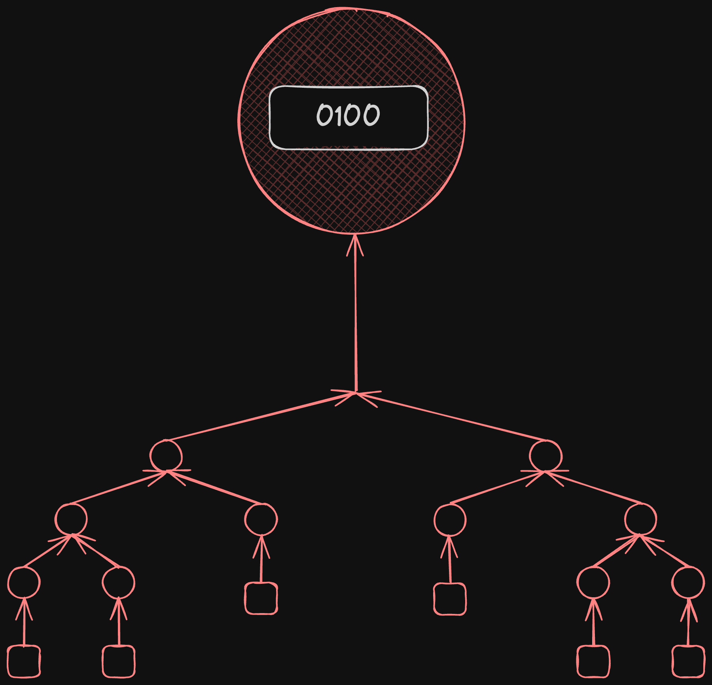

# Reduced On-Chain Storage
This document outlines the approach to significantly reduce the on-chain storage of Storage Hub, by preventing it from scaling with the amount of files stored in Storage Hub. Scalability is the main goal here, accomplished at the expense of a more complex system, but one that would allow Storage Hub not to store information on a per-file basis, providing mostly the same guarantees to users.

### Terminology
- MSP: Main Storage Provider.
- BSP: Backup Storage Provider.
- SP: Storage Provider (refers to both Main and Backup).

### Goals of the Design
1. Have an on-chain storage that does not scale with the number of files, but with something smaller like the number Storage Providers. Assuming that there is only a 64-byte Blake2B hash on-chain per file, if the system reaches the 1 billion files mark, it would have a state of 64GB just for those hashes. That is without taking into consideration the storage keys for the Patricia Merkle Trie that is the state, any other pallet's storage, and not even counting storing states from previous blocks.
2. Being able to direct users to the MSP that is storing a given file, without having a storage item on-chain, per file.
3. Incentivising both positively (rewards) and negatively (punishment for bad behaviour) Storage Providers, to store all the files they are supposed to be storing, in hot storage. This is interpreted as "the runtime should be able to request, at random, a storage proof for any of the files that a given Storage Provider is supposed to be storing, without knowing specifically which files that Storage Provider is storing".
4. Have incentives in place to provide the higher certainties that a user can change from one MSP to another, permissionlessly.

### Assumptions
1. Files are identified by the location they are stored in. In other words, a file path.
2. Besides the file path, when storage is requested for a file, a Merkle root or hash of the file is provided by the user, to ensure the correctness of the content of the file.
3. This design is not concerned with how the storage proof for a file works, but rather how to verify storage proofs, without having a Merkle root or hash of the content of that file on-chain. For illustration purposes, the reader can assume a simple proving mechanism in which each file is cut into small chunks of data (that can fit as arguments of one transaction), and a Merkle Patricia Trie is constructed using those chunks as leafs. The Storage Provider that is supposed to store it, would be periodically requested to provide a valid Merkle proof, for a random leaf hash. In the case that hash does not match an exact leaf -which will be the most frequent case- the proof for the nearest existing chunk would have to be given. The nearest existing chunk hash is defined as:
	1. The one with the longest common prefix.
	2. If there are more than one with the longest common prefix, it is the closest numerically speaking.
	For example, assuming 4 bit hashes, if the random hash requested is `0b0110`, and the node only has chunks with hashes `0b0100`, `0b0101` and `0b0111`, the closest is `0b0111` as it shares the prefix `0b011`. If instead it only has `0b0100` and `0b0101`, both with a shared prefix of `0b01`, the closest is `0b0101`, as it is at a numerical distance of 1, whereas `0b0100` is at a numerical distance of 2.

	

## Buckets and Merkle Patricia Forests
For starters, the approach taken is varies in the case of BSPs and MSPs, as they have different roles and incentives. For MSPs, the concept of **buckets** is introduced, which is a subset of files from a user, that all share a common prefix in their file paths, and are all in the same MSP. In other words, when a user wants to store a file in an MSP, it creates a bucket, and then places files in that bucket, which are all under that same MSP's care. Each file path would look something like this:
```
<owner-id>/<bucket-id>/some/arbitrary/path/the/user/wants
```
This way, the only information that needs to be stored on-chain, is a mapping of `bucket-id` to the MSP that stores all the files in it. If a user wants to retrieve a file, it is assumed that it would know the path to it, so it can know to which bucket it belongs, and therefore know the MSP that is storing it. Afterwards, the user would have to check with that specific MSP the exact details of the retrieval mechanisms available. With this approach, for MSPs, the Storage Hub state would scale with the number of buckets.

In the case of BSPs, the concept of buckets doesn't exist, and it is intended that each new file, no matter what bucket it belongs to, is assigned to a random set of BSPs. Put differently, files in a bucket are not stored by the same set of BSPs. Therefore, for BSPs, there would be a **Merkle Patricia forest root** for each BSP. The Merkle Patricia forest is understood as the Merkle Patricia Trie whose leafs are the Merkle roots of each file the BSP is storing. Under this design, for BSPs, the Storage Hub state would scale with the number of BSPs in the network.

## Requesting Proofs
With the introduction of **buckets** for MSPs, and **Merkle Patricia forest roots** for BSPs, the runtime looses the ability to request a proof for a given file, to the Storage Provider that is supposed to be storing it. The following algorithm describes how the runtime would request storage proofs in this design, ensuring that eventually all storage proofs are requested, and in random order, without having any knowledge of the Merkle roots of each file. The algorithm is the same for buckets and Merkle Patricia forests, because buckets would also have a Merkle Patricia forest root linked to them, with the distinction that there can be multiple bucket "roots" for each MSP. So from here on, consider that the Merkle Patricia forest root can be the root linked to a bucket, or a BSP.

1. Each Merkle Patricia forest can be imagined as the following diagram:
	
	The red nodes are Merkle roots of files under this forest, and given that it is a Patricia Trie, they are located in the position of the trie that corresponds to their content. Underneath every red node, there is the Merkle Patricia Trie of the file. In this example the hash space is of 4 bits, for simplicity, meaning that this Trie stores files whose Merkle roots go from `0b0000` to `0b1111`.
2. The runtime will assign a random hash in this Merkle Patricia forest to be proven. Given that the runtime has no knowledge of the files included in this Merkle Patricia forest, the Storage Provider responsible for it is required to provide a proof for that exact random hash, if it exists in the forest, or the nearest existing hash.  The nearest existing chunk hash is defined as:
	1. The one with the longest common prefix.
	2. If there are more than one with the longest common prefix, it is the closest numerically speaking.
	For example, assuming 4 bit hashes, if the random hash requested is `0b0110`, and the node only has chunks with hashes `0b0100`, `0b0101` and `0b0111`, the closest is `0b0111` as it shares the prefix `0b011`. If instead it only has `0b0100` and `0b0101`, both with a shared prefix of `0b01`, the closest is `0b0101`, as it is at a numerical distance of 1, whereas `0b0100` is at a numerical distance of 2.
3. Using the image as example, if the random hash given by the runtime is `0b0111`, which exists, the Storage provider would provide a proof for that file, alongside the nodes highlighted in green, for proving it belongs to the Merkle Patricia forest.
4. If instead the random hash given is `0b0110`, the SP would also provide the same proof for the node in `0b0111`, which wouldn't be a valid Merkle proof if the node `0b0110` existed.
5. In that same case, with the random hash being `0b0110`, if the SP wanted to trick the runtime by providing a proof for `0b0101` as the closest node, for it to be a valid Merkle proof it would have to include the node in `0b0111`, which would not be the zero hash, and shares a longer prefix with `0b0110`. Therefore the proof would be rejected, and the SP punished.
6. If now a new file is added in `0b0110` (node in blue), the Merkle Patricia forest would look like this:
	
6. If the SP is now requested the same `0b0110` proof, it would have to provide the nodes highlighted in green, plus the storage proof itself for that file.
7. If the SP wanted to trick the system and provide a proof for `0b0111` it wouldn't be able to do it, because a valid Merkle proof for it would actually include the node `0b0110`, which is closer (identical) to the requested `0b0110`.

If the randomness of file Merkle roots requested by the runtime is good, and the requests are frequent, the Storage Providers would be properly incentivised to maintain their Merkle Patricia forests truthfully, store all the files in it, and provide the appropriate proofs.

## Modifying a Merkle Patricia Forest Root
Given that the Merkle Patricia forests are maintained by the Storage Providers -one for each BSP, and one for each bucket in the case of MSPs-, they are also responsible for changing their forest roots when a new file is added, modified or deleted. Consequently, there has to be a mechanism to prevent them from wrongfully changing their forest roots.

To change a forest root under its care, a Storage Provider has to first provide a valid Merkle proof for the nearest node, under the current Merkle Patricia forest root. Then the runtime would compute the new root using that same proof. For example, for adding a file with a Merkle root of `0b0110` here:


And get to this:


The corresponding Storage Provider would have to provide a valid Merkle proof for node `0b0111`, which is the nearest to `0b0110`, prior to the change (see highlighted green nodes). With the very same nodes given for the proof of `0b0111`, the new Merkle Patricia forest root can be computed. The node in the `0b011_` position can be calculated from the hashes of `0b0110` and `0b0111`, and so on until the forest root.

## Changing MSP
One concern that arises from such a design, is that now MSPs are not able to see the set of BSPs storing copies of a given file. So if a user wants to change its bucket from one MSP to another -which it should be able to, and that is what BSPs are for- only with the information on-chain, the new MSP does not know the Merkle roots of all the files under that bucket's Merkle Patricia forest, and most importantly, it doesn't know to which BSPs it should ask for it. Honest BSPs would willingly provide the files they are storing from that bucket, and they can be aware of it, since BSPs would have information of the files they are storing, including the paths, whose prefix includes the bucket ID. However dishonest BSPs, could ignore the change of MSP, and the new MSP would have no way to request a file of which it doesn't even know the identifier, nor the Merkle root.

To mitigate this, MSPs will be required to run a full node of Storage Hub, and index the parachain to maintain an internal database of the buckets, the files in them, and the BSPs storing them. That way, if they are selected as new MSPs for an existing bucket, they know who to ask for the files, and if they do not receive a file, they can request on-chain the proofs for that file's Merkle root. This request would apply to all BSPs, and those who have it would be forced to disclose themselves.

It cannot be easily proven if a file is sent or not from a BSP to an MSP, as it is an off-chain action entirely, and it goes back to the original retrievability problem why the concept of MSPs was first introduced. Therefore the system here relies on the decentralisation of BSPs, and the chances of at least one of them, who stores a replica of the file, to be an honest BSP.

An MSP can choose not to run a full node, and then either reject all storage requests coming to it, for existing buckets, or rely on external services that might be running a full node, indexing Storage Hub, and exposing this information. It should be remembered that MSPs are expected to run expensive infrastructure for retrievability, so the added cost of running a full node and indexer, without exposing public endpoints or RPCs, shouldn't be that significant.