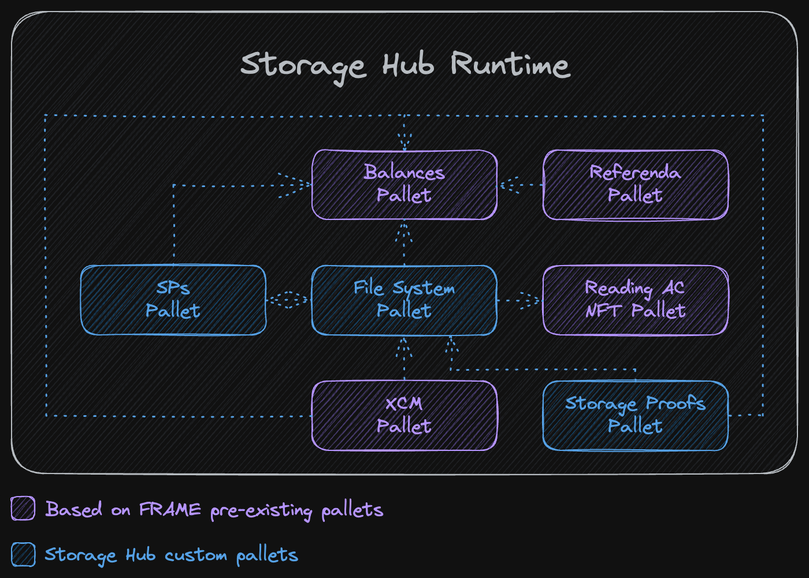
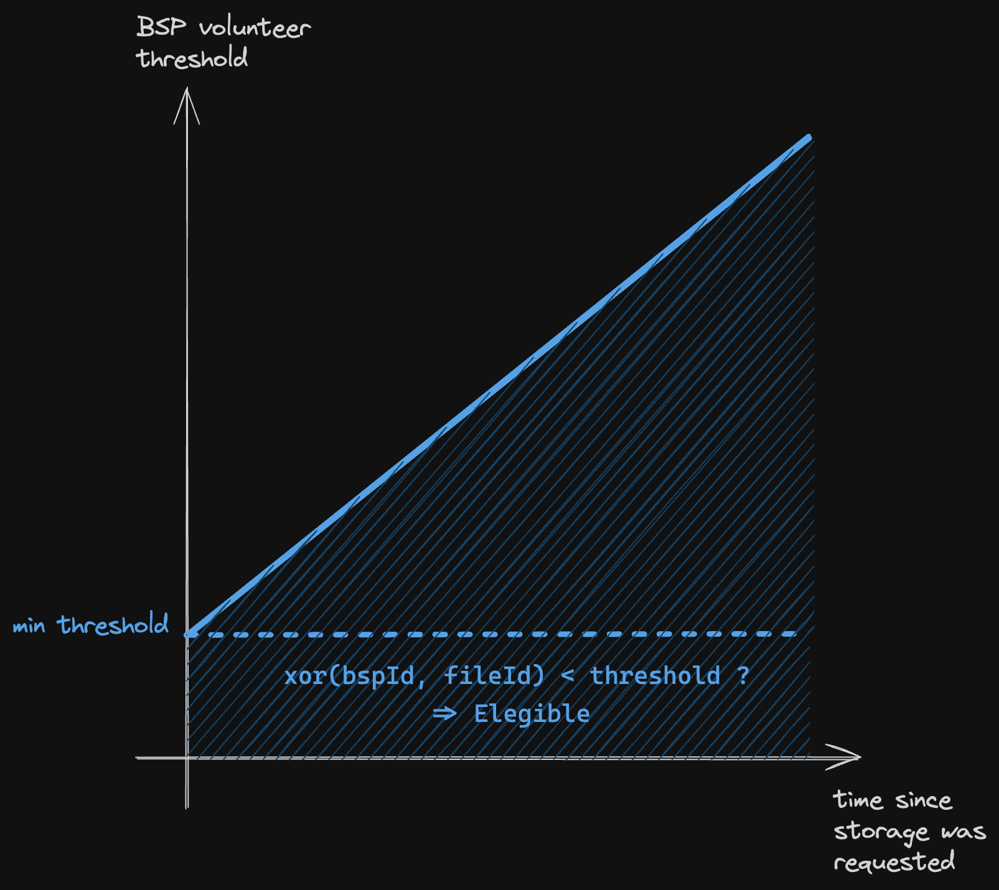
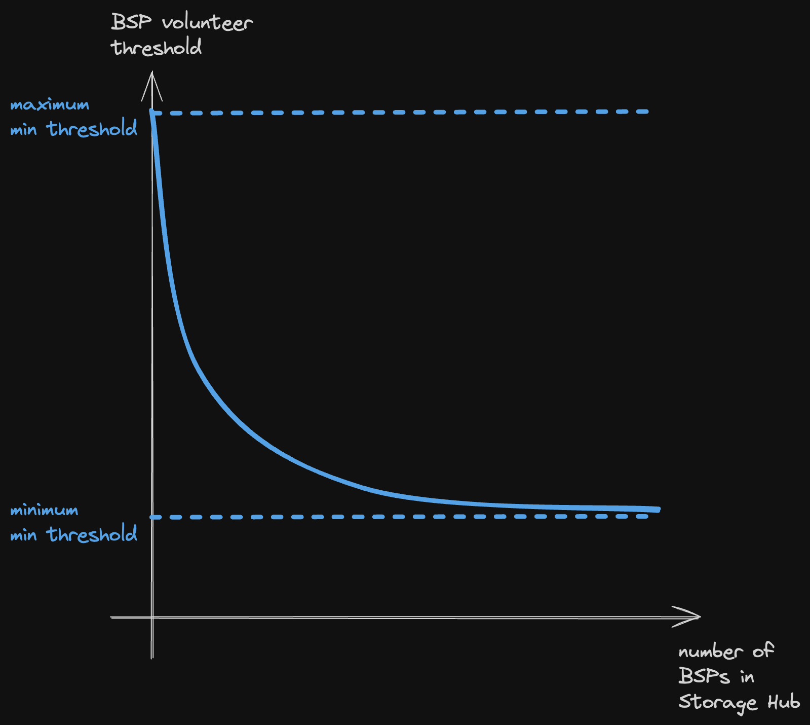
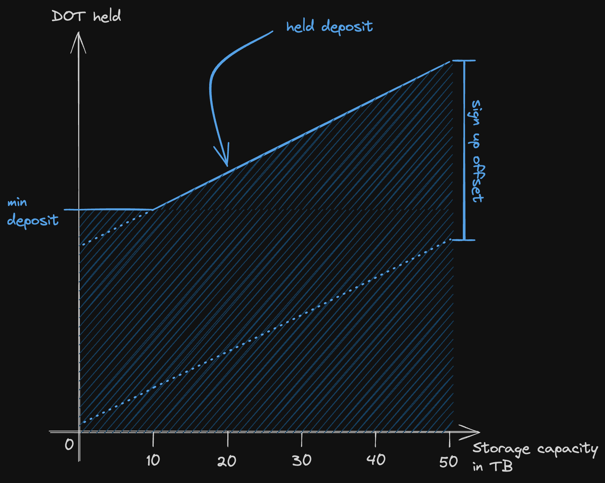

# Runtime Breakdown
This document explores the different components that will make up StorageHub's runtime. While there is a strong effort in planning beforehand with the outmost attention to detail, this is expected to be a one-year's work implementation. Therefore it is worth mentioning that the final deliverable may vary in the exact amount and description of components shown below.

The runtime is based on [Substrate](https://docs.substrate.io/) and [FRAME](https://docs.substrate.io/reference/frame-pallets/). The following are the set of pallets considered necessary for StorageHub to provide its basic functionalities described in the design proposal. It should be clarified however, that this is not strictly the entire set of pallets, as there can be more later for miscellaneous operations of the parachain. Moreover, some of these pallets could be broken down into more than one for implementation purposes.



Aside from the previously highlighted pallets in the diagram, the runtime is also formed with additional pallets that make up a regular Cumulus-based parachain. Such pallets include:
1. System Pallet
2. Parachain System Pallet
3. Timestamp Pallet
4. Parachain Info Pallet
5. Transaction Payment Pallet
6. Sudo Pallet
7. Authorship Pallet
8. Collator Selection Pallet
9. Session Pallet
10. Aura Pallet
11. Aura Ext Pallet
12. XCMP Queue Pallet
13. Polkadot XCM Pallet
14. Cumulus XCM Pallet
15. Message Queue Pallet

### Terminology
- MSP: Main Storage Provider.
- BSP: Backup Storage Provider.
- SP: Storage Provider (refers to both Main and Backup).
- Fingerprint: a cryptographic output that uniquely identifies the contents of a file, like a hash or a Merkle root. The file itself is identified by its location and that cannot change (moving the file is like deleting that one and creating another), but the content of the file can change, and therefore so its fingerprint

## File System Pallet
The core of StorageHub. This pallet holds the allocation of files in Storage Providers in the form of "Merkle Patricia Forests", which are no other thing than Merkle Patricia Tries, whose leaves are the Merkle roots identifying the files stored under that "Forest". The only information that is stored on-chain is the root of the Merkle Patricia Forest, which has a different interpretation for MSPs than it has for BSPs. For the former, each root of a Merkle Patricia Forest represents a *bucket*. A *bucket* is a group of files who are all stored by the same MSP, and share a prefix in their path. In other words, the location of all files of a given `<user-id>`, under the same `<bucket-id>` would be:
```
<user-id>/<bucket-id>/(... arbitrary path to files ...)
```
A user can have many buckets, stored by different MSPs, and one MSP can store multiple buckets, from different users. For this purpose, there is an on-chain mapping that links a `<bucket-id>` to the MSP storing it, and its root.

As for BSPs, there is one Merkle Patricia Forest root per BSP, which represents all the files that BSP is storing. One BSP can store files from different buckets, and all the files in a bucket will not necessarily be stored under the same BSP. In fact, in most cases, files in a bucket will be stored by multiple different BSPs.

For more details on how these Merkle Patricia Forests work, read [Reduced On-Chain Storage](reducedOnChainStorage.md).

StorageHub is *location-addressed*, mainly to allow for updates of a given file. However, that does not mean that the fingerprint of the file will not be kept as well. In fact, the leafs of the Merkle Patricia Forests are hashes of each file's metadata, which includes its location, fingerprint and size, among others.

### Requesting Storage and BSP Assignment
When a storage request is received (i.e. the corresponding extrinsic is executed), an event is emitted: it notifies the Main Storage Provider and announces the file for potential Backup Storage Providers. If the MSP accepts the request, it should send a transaction confirming the commitment, as it is possible for an MSP to reject providing service. On the BSPs side, they have to monitor storage requests and volunteer as Backup Storage Providers for a given file. To prevent front-running attacks from BSPs who might have an advantage over others, and would always volunteer first, leading to centralisation of storage in BSPs, there are two mechanisms in place. Firstly, there is a cap on how much data a single BSP can store, and it is related to the amount of collateral it adds to the system. Secondly, and most important, there is a random subset of BSPs that can initially volunteer for storing a given file. To determine whether or not a BSP belongs to that subset, one must compute the XOR of the file ID —which in the end is a hash based on the file's content— and the BSP ID —also a hash. If the result falls below a set threshold, the BSP is elegible. This threshold increases over time, to eventually allow for all BSPs to volunteer. This is needed in case there are no-shows at the beginning for those BSPs allowed at first.



This minimum threshold should also be adjusted based on the number of BSPs signed up in StorageHub. This is because at first, with just a handful of BSPs, the minimum threshold should be sufficiently high, to still allow for a reasonable number of BSPs to join. As more BSPs join the network, the minimum threshold should be more selective.



When MSPs and BSPs send the transaction that sets them as Storage Providers for a file, that information is registered in the `StorageRequests` mapping. This mapping grows with number of storage requests, and it gets cleared whenever the `MaxBspsPerFile` is reached, and the MSP accepted the request as well. One important clarification is that for this to happen the MSP and BSPs have to be confirmed. Being confirmed as an MSP, means that the MSP modifies the Merkle Patricia Forest root of the bucket and therefore has the file. On the other hand, for a BSP, it means that it modified the Merkle Patricia Forest root for that BSP. This extrinsic is part of the [Storage Proofs Pallet](runtimeBreakdown.md#Storage-Proofs-Pallet).

When a storage requests are generated, they are also registered in the `BlockToStorageRequest` mapping, which links storage requests to the block they were generated in. This data structure is used to clean up the `StorageRequests` mapping when a number of  `StorageRequestExpirationBlocks` has elapsed since the request was submitted. If it gets to this point, the storage requests for the expired block get purged, no matter the number of BSPs that registered for it, and a corresponding event is emitted. Ideally, that should never be the case if the BSPs network is sufficiently decentralised, as there would always be enough BSPs interested in storing the users' files.

### Deleting a File
File deletion, interpreted as removing a file's leaf from Merkle Patricia Forests —be it for buckets or BSPs— is a non-trivial action in the context of [Reduced On-Chain Storage](reducedOnChainStorage.md). When a user generates a `StorageRequest`, the BSPs that sign up for it, and the MSP that was selected, add the metadata of that file to their Merkle Patricia Forests, including data like the file location, owner, fingerprint of the file, and size. This process can be checked at the time by the runtime, and from there on, whenever a Storage Provider submits a valid proof for it, it can charge for storing that file. Even though the runtime will eventually have no additional information about that file, it can be certain that if it is included in a Merkle Patricia Forest of an SP, the information about the owner and size of the file, are correct.

However, if the user wants to delete a file and stop paying for it, there is no on-chain information of who is storing that file. If later on, a Storage Provider submits a valid proof for that file, the runtime shouldn't allow it to charge for that file. Therefore, the runtime needs to enforce that *all* the Storage Providers storing a file, delete that metadata from their Merkle Patricia Forests. Moreover, it needs to do that without knowing who are those Storage Providers storing the file.

The proposed way for ensuring file deletion from Merkle Patricia Forests is that whenever the user executes `delete_file` successfully, a challenge for this file is queued in the next round of storage proofs. Additionally, a new entry is added to `DeletionRequests`, so that in the next round of proofs, when the Storage Providers storing this file are forced to provide a valid proof for this file specifically, their Merkle Patricia Forest roots can be modified by the runtime directly. This means that their bucket or BSP Merkle roots are correctly modified as soon as they provide the next round of proofs, preventing them from ever charging for storing this file again.

### Cleaning up On-Chain Storage
In the previous sections it was explained that a `StorageRequest` is generated when a user executes `request_storage`, and the same for a `DeletionRequest` in the case of `delete_file`. This per-file on-chain storage needs to be cleared out for the benefits of [Reduced On-Chain Storage](reducedOnChainStorage.md) to have an impact.

`StorageRequests` have a `remaining_bsps_slots` field, that is initialised with `MaxBspsPerFile`. As more BSPs are confirmed to be storing that file, this field is decremented. Once it reaches zero, the `StorageRequest` is cleared from on-chain storage. In the case the number of `MaxBspsPerFile` is never reached, there is a timeout that automatically clears out this storage, and that is where the `BlockToStorageRequest` mapping comes into play. An inherent is executed at the beginning of the block, which accesses `BlockToStorageRequest` with a block number that is `StorageRequestExpirationBlocks` less than the current block. If there are any `StorageRequests` left there, they are cleared from the state, and a corresponding event is emitted.

The same concept applies to `DeletionRequests`, with the corresponding `BlockToDeletionRequest` and `DeletionRequestExpirationBlocks`.

### BSPs are Independent Actors
BSPs are independent actors in this design, meaning they do not act as a coordinated network, but rather as individuals with a lot of similarities, who interact with the runtime and provide their services to the network. This design choice naturally impacts the complexity of the runtime, which assumes the responsibility of data assignment and discovery. In the case of the former, it is mitigated by having BSPs volunteer for storing a file, eliminating any computational burden on the runtime. For the latter, it is needed to keep records on-chain of which BSPs are assigned to a file, which increases the state size of the parachain. It must be understood however, that this decision is part of a larger design, and having the information of which BSP is storing a given file, impacts other aspects like incentives and storage proofs. Another approach where this is not the case is discussed [here](distributedP2PBspNodes.md), in which BSPs are not independent actors, but rather a collaborative peer-to-peer network of nodes. Consequently, the runtime is not aware of who is storing what, so it treats the whole network as one entity, and data discovery is handled through protocols like Kademlia and DHTs. The key takeaways of this approach, and the reasons why this is not the path chosen are:
1. Without having file accountability on-chain, the runtime cannot punish a single BSP for not proving that a file is being stored. The only option left is to punish the entire network of BSPs as one entity that failed to provide all the corresponding proofs. But the punishment cannot be as severe, because all of the network cannot be fully slashed for the failures of some of its actors. This has two consequences: 
	1. There is a higher risk of becoming a BSP, as you are now subject to punishment for other BSPs behaviour.
	2. StorageHub provides less certainties to its users, because the punishment for loosing the users' data has to be less severe and is shared by the network.
2. The implementation of a BSP increases in complexity and hardware costs (specially around networking) due to having to support data discovery and availability protocols like Kademlia. There is significantly increased network traffic, which is something that this design was deliberately trying to avoid for BSPs.  
3. BSPs implementation becomes more complex due to having to support these protocols, potentially opening up to more attack vectors. Moreover, since the runtime treats the whole network as one entity, a successful attack on the BSPs peer-to-peer network, is a successful attack on all of StorageHub. Considering that BSPs are what provide reliability and unstoppability to StorageHub, then the system is only as secure as the peer-to-peer network.
4. Not being able to incentivise —positively and negatively— each BSP for storing a given file, and instead dealing with an entire network, would make the incentives design for storage proofs much more complicated.

### Extrinsics
1. `request_storage`: Creates a new entry in the `StorageRequests` with the new file to be stored. Performs basic checks like user having a minimum amount of funds, the MSP selected existing, etc. The extrinsic takes as arguments —at least— the bucket selected, file location, fingerprint, size and [multiaddress](https://docs.rs/fluence-fork-libp2p/latest/libp2p/#multiaddr) from where the user will send the file. Emits a `NewFile` event that notifies the MSP of its selection, and announces the new file for BSPs to volunteer.
2. `msp_accept_file`: Expresses the consent of an MSP to store a file it was assigned to. Can only be successfully run by the assigned MSP. From there on, the MSP can be slashed if it does not provide the corresponding storage proofs when it should. Accepting the storage request implies that some of the collateral tokens of that MSP are frozen.
3. `bsp_volunteer`: Used by a BSP to volunteer for storing a file. The transaction will fail if the XOR between the file ID and the BSP ID is not below the threshold, so a BSP is strongly advised to check beforehand. Another reason for failure is if the maximum number of BSPs has been reached. A successful assignment as BSP means that some of the collateral tokens of that MSP are frozen.
4. `msp_resign`: Executed by an MSP to stop providing services for a file. A compensation should be provided for the user, to deter this behaviour. 
5. `bsp_resign`: Executed by a BSP to stop storing a file. A compensation should be provided for the user, to deter this behaviour. A successful execution of this extrinsic automatically generates a storage request for that file with one `remaining_bsps_slot` left, and if a storage request for that file already exists, the slots left are incremented in one. It also automatically registers a challenge for this file, for the next round of storage proofs, so that the other BSPs and MSP who are storing it would be forced to disclose themselves then.
6. `assign_writing_permissions`: Used by owner or manager of a file, to assign writing, modifying or managing permissions to an XCM MultiLocation (wildcard or specific). Manager permissions cannot be assigned as wildcards, only to specific accounts, which can also be sovereign accounts of an XCM MultiLocation. There is a maximum array of assigned permissions, that is why wildcards are available.
7. `overwrite_file`: Same as executing `request_storage` for the new file, plus `delete_file` for the previous one, except that the MSP is already assigned. Nonetheless, the MSP has to accept the change with its transaction, and for BSPs, the process is just like a new `request_storage`. Previously assigned BSPs are released of their duties effective immediately after this transaction, following the same process described in `delete_file`. The transaction should also validate that the XCM MultiLocation requesting the change is allowed.
8. `delete_file`: Used by the owner of a file to terminate the storage agreement and stop paying for it, effective immediately after the transaction passes successfully. Emits an event for the corresponding BSPs and MSP to be notified that they should clear out their storage, and not provide anymore proofs. Both kinds of Storage Providers are now required to modify their Merkle Patricia Forest roots. This is achieved by registering a challenge for this file in the next round of storage proofs, and adding this file to the `DeletionRequests` mapping. To accomplish this, the extrinsic should take as arguments the file's location, fingerprint and size (and any other information that is included in the metadata used for generating the leaf hash of the Merkle Patricia Forest).
9. `change_msp`: Used by the owner of a file to request a change to another MSP. Just like with `request_storage`, the new MSP has to accept the request, and the previous one is not required to provide anymore proofs, nor charge for storing this file any longer, and this is ensured by changing ownership of the bucket. Emits an event for the new MSP to be notified of its selection, and the old MSP to delete the file from its storage.
10. `create_bucket`: Used by a user to generate a new bucket for adding files, under the care of a chosen MSP. The arguments of this transaction should include —at least— the MSP selected, and the price per data unit that the user will pay to the MSP, as it is possible that an MSP offers multiple value propositions and plans, depending on the cost.
11. There is also an extrinsic to set each of the **Config Values**, which must be executed with root origin.

### Inherents
1. `clean_storage_requests`: Accesses `BlockToStorageRequest` with a block number that is `StorageRequestExpirationBlocks` less than the current block. If there are any `StorageRequests` left there, they are cleared from the state, and a corresponding event is emitted.
2. `clean_deletion_requests`: Same as `clean_storage_requests`, but with the corresponding `DeletionRequests`, `BlockToDeletionRequest` and `DeletionRequestExpirationBlocks`.

### Storage
1. `StorageRequests`: a mapping from file location to file's metadata of storage requests who are still pending on BSPs to volunteer, or MSP to accept.
	```rust
	#[pallet::config]
	pub trait Config: frame_system::Config {
		type BspsCount: Parameter
			+ Member
			+ MaybeSerializeDeserialize
			+ Debug
			+ Default
			+ MaybeDisplay
			+ AtLeast32Bit
			+ Copy
			+ MaxEncodedLen
			+ HasCompact;
	}
	
	/// A byte array representing the file path.
	pub type FileLocation<T> = BoundedVec<u8, MaxFilePathSize<T>>;
	pub struct StorageRequest {
		pub fingerprint: Fingerprint,
		pub msp: StorageProviderId,
		pub is_msp_confirmed: bool,
		pub bsps_volunteered: BoundedVec<StorageProviderId, MaxBsps>,
		pub bsps_confirmed: BoundedVec<StorageProviderId, MaxBsps>,
		pub remaining_bsp_slots: BspsCount,
		pub is_public: bool,
		[...] // Other relevant metadata.
	}
	
	#[pallet::storage]
	pub type StorageRequests<T: Config> = StorageMap<FileLocation<T>, StorageRequest<T>>;
	```
2. `BlockToStorageRequest`: a mapping from block number to storage requests registered in that block (or rather the `FileLocation` of those storage requests). This is used for clearing expired storage requests.
	```rust
	#[pallet::storage]
	pub type BlockToStorageRequest<T: Config> = StorageMap<
		BlockNumber,
		FileLocation,
	>;
	```
3. `TotalUsedBspStorage`: the total amount of storage being used from the BSPs capacity.
	```rust
	#[pallet::config]
	pub trait Config: frame_system::Config {
		type StorageCount: Parameter
			+ Member
			+ MaybeSerializeDeserialize
			+ Debug
			+ Default
			+ MaybeDisplay
			+ AtLeast32Bit
			+ Copy
			+ MaxEncodedLen
			+ HasCompact;
	}

	#[pallet::storage]
	#[pallet::getter(fn total_used_bsps_storage)]
		pub type TotalUsedBspStorage<T: Config> = StorageValue<_, <T as Config>::StorageCount>;
	```
4. `MinBspAssignmentThreshold`: the minimum threshold that the XOR operation between a file ID and a BSP ID should meet, to instantly be eligible as BSP for that file. This minimum threshold should decrease when more BSPs are added to the system, and increased if BSPs leave the system.
	```rust
	#[pallet::config]
	pub trait Config: frame_system::Config {
		type AssignmentThreshold: Parameter
			+ Member
			+ MaybeSerializeDeserialize
			+ Debug
			+ Default
			+ MaybeDisplay
			+ AtLeast32Bit
			+ Copy
			+ MaxEncodedLen
			+ HasCompact;
	}

	#[pallet::storage]
	#[pallet::getter(fn min_bsps_assignment_threshold)]
		pub type MinBspAssignmentThreshold<T: Config> = StorageValue<_, <T as Config>::AssignmentThreshold>;
	```
5. `DeletionRequests`: A mapping linking a file's fingerprint to the MSP and BSPs who have removed it from their Merkle Patricia Forests. It gets created when a user executes `delete_file`, and is cleared after
	```rust
	#[pallet::config]
	pub trait Config: frame_system::Config {
		/// A leaf of a Merkle Patricia Forest, basically the hash(file_location, fingerprint)
		type FileLeaf: Parameter
			+ Member
			+ MaybeSerializeDeserialize
			+ Debug
			+ MaybeDisplay
			+ SimpleBitOps
			+ Ord
			+ Default
			+ Copy
			+ CheckEqual
			+ AsRef<[u8]>
			+ AsMut<[u8]>
			+ MaxEncodedLen;
	}
	
	pub struct DeletionRequest {
		pub msp: Option<StorageProviderId>,
		pub bsps: BoundedVec<StorageProviderId, MaxBsps>,
	}
	
	#[pallet::storage]
	pub type DeletionRequests<T: Config> = StorageMap<FileLeaf<T>, DeletionRequest<T>>;
	```
6. `BlockToDeletionRequest`: a mapping from block number to delete requests registered in that block (or rather the `FileLeaf` of those delete requests). This is used for clearing expired delete requests.
	```rust
	#[pallet::storage]
	pub type BlockToDeletionRequest<T: Config> = StorageMap<
		BlockNumber,
		FileLocation,
	>;
	```
### Config Values
1. `MaxBspsPerFile`: maximum number of BSPs that can volunteer as providers for a given file.
2. `MaxMinBspThreshold`: the minimum BSP threshold for volunteering for a storing a file, when there are only `MaxBspsPerFile` BSPs signed up in StorageHub.
3. `MinMinBspThreshold`: the maximum BSP threshold for volunteering for storing a file, when there is an infinite number of BSPs signed up in StorageHub.
4. `StorageRequestExpirationBlocks`: the number of blocks it takes for a storage request to be cleared from `StorageRequests` mapping, no matter if it reached `MaxBspsPerFile` number of BSPs.
5. `DeletionRequestExpirationBlocks`: the number of blocks it takes for a delete request to be cleared from `DeletionRequests` mapping. Should be large enough to be certain that all Storage Providers who have this file in their Merkle Patricia Forests, are challenged and delete it.

## Storage Providers Pallet
An accounts based pallet, with two kinds of accounts: Main and Backup Storage Providers. Both accounts have things in common, and things that are specific to each.

What differentiates the two kinds of Storage Providers is the information they sign up with. While BSPs should only sign up their [multiaddress](https://docs.rs/fluence-fork-libp2p/latest/libp2p/#multiaddr) for users and other MSPs to know where to connect with them, an MSP also provides the basic information of the value proposition it offers. We say basic because the value propositions can vary as much as use-cases can exist. It should be acknowledged though, that given the off-chain nature of the agreement between MSP and user, most of the information of the value proposition of the MSP will be exposed off-chain, and it is in the MSP's best interest to be truthful about it.

In order to sign up as a Storage Provider, the related account must hold an `SpMinDeposit` number of tokens in the [Balances Pallet](#Balances-Pallet), and this grants that Storage Provider a capacity of `SpMinCapacity` units of data. The reason for this held deposit is twofold: it serves as collateral in case the SP looses some users' data, and it prevents a single Backup Storage Provider from signing up with multiple accounts to have a higher chance of qualifying for storing a file faster (a sort of sybil attack). From there on, the Storage Provider can increase its storage capacity linearly by holding more funds, and the slope of that linear function is determined by how many tokens are slashed from the Storage Provider if it fails to provide storage proofs for a given amount of data.



The image above shows how the storage capacity relates to the amount of tokens a Storage Provider holds. For illustrative purposes, in the diagram, `SpMinCapacity = 10TB`, which is the capacity a Storage Provider gets when it deposits `SpMinDeposit`. From there on, the capacity increases linearly with the number of tokens held, with a `DepositPerData` slope. It can also be visualised that the `SpMinDeposit =! DepositPerData * SpMinCapacity`, difference that is marked as "sign up offset". This offset is what discourages a single server running a Backup Storage Provider from increasing its storage capacity by adding more accounts as Storage Providers, and increasing the chances of being qualifying for storing a file as well (previous sybil attack).

A Storage Provider can reduce its held funds only if the remaining amount after the reduction is sufficient for its current `sp.data_stored`. In the case in which an SP would like to exit StorageHub and withdraw its `SpMinDeposit`, it should be true that `sp.data_stored = 0`, i.e. it is not storing any file at the moment.

Whenever there is a sign up, sign off, or change in the storage capacity of a BSP, there is a variable in the parachain's state that keeps track of the total capacity of BSPs, for the storage base price adjustment. That variable is `TotalBspsCapacity`. Note that MSPs are not part of this accounting.
### Extrinsics
1. `msp_sign_up`: the account executing the transaction becomes an MSP. Besides providing the basic information of an MSP, it should also deposit at least `SpMinDeposit`.
2. `bsp_sign_up`: the account executing the transaction becomes a BSP. Besides providing the basic information of a BSP, it should also deposit at least `SpMinDeposit`. `MinBspAssignmentThreshold` should be decremented accordingly.
3. `msp_sign_off`: the account executing the transaction signs off as MSP. It should be true that `sp.data_stored = 0`, and in that case, all funds are released for that account.
4. `bsp_sign_off`: the account executing the transaction signs off as BSP. It should be true that `sp.data_stored = 0`, and in that case, all funds are released for that account. `MinBspAssignmentThreshold` should be incremented accordingly.

### Storage
1. `Msps`: mapping of signed up Main Storage Providers.
	```rust
	pub struct ValueProposition {
		pub data_limit: StorageData, // A number type.
		pub protocols: BoundedVec<Protocols, MaxProtocols>,
		[...] // Other relevant data for the value proposition.
	}
	pub struct MainStorageProvider {
		pub data_stored: StorageData, // A number type.
		pub multiaddress: MultiAddress,
		pub value_prop: ValueProposition,
	}

	#[pallet::storage]
	pub type Msps<T: Config> = StorageMap<
		T::AccountId,
		MainStorageProvider,
	>;
	```
2. `Bsps`: mapping of signed up Backup Storage.
	```rust
	pub struct BackupStorageProvider {
		pub data_stored: StorageData, // A number type.
		pub multiaddress: MultiAddress,
		pub root: MerklePatriciaRoot, // The root of the Merkle Patricia Forest of this BSP.
	}

	#[pallet::storage]
	pub type Bsps<T: Config> = StorageMap<
		T::AccountId,
		BackupStorageProvider,
	>;
	```
3. `TotalBspsCapacity`: the sum of all the BSPs storage capacity. It is updated every time a BSP signs up, signs off, or holds more funds to increase its storage capacity.
	```rust
	#[pallet::storage]
	#[pallet::getter(fn total_bsps_capacity)]
		pub type TotalBspsCapacity<T: Config> = StorageValue<_, StorageData>;
	```
4. `BspsVec`: a vector of BSPs account IDs, to be able to draw some of them for storage proofs challenges.
	```rust
	#[pallet::storage]
	pub type BspsVec<T: Config> = StorageValue<_, BoundedVec<T::AccountId, MaxBsps>, ValueQuery>;
	```
 5. `Buckets`: mapping of bucket ID to bucket metadata.
	```rust
	pub struct Bucket {
		pub data_stored: StorageData, // A number type.
		pub root: MerklePatriciaRoot, // The root of the Merkle Patricia Forest of this bucket.
	}

	#[pallet::storage]
	pub type Buckets<T: Config> = StorageMap<
		BucketId,
		Bucket,
	>;
	```
6. `BucketsVec`: a vector of bucket IDs, to be able to draw some of them for storage proofs challenges.
	```rust
	#[pallet::storage]
	pub type BucketsVec<T: Config> = StorageValue<_, BoundedVec<T::AccountId, MaxBuckets>, ValueQuery>;
	```

### Config Values
1. `SpMinDeposit`: the minimum deposit for an account to become a Storage Provider.
2. `SpMinCapacity`: the storage capacity that is given to a Storage Provider when depositing `SpMinDeposit`.
3. `DepositPerData`: the slope of the collateral vs storage capacity curve. In other terms, how many tokens a Storage Provider should add as collateral to increase its storage capacity in one unit of data.
4. `MaxBsps`: maximum total number of BSPs in the network.
5. `MaxBuckets`: maximum total number of buckets in the network. Should be practically impossible to reach, and if it is ever reached, it would signify reaching a scalability sealing.

## Storage Proofs Pallet
This pallet is in charge of generating challenges for storage proofs, verifying those challenges and allowing Storage Providers to charge for their service, after submitting the appropriate proofs. For a detailed explanation of how the storage proofs for a specific file are going to work, and the decision process behind it, head over to [Storage Proofs](storageProofs.md).

Challenges for files will be given out at random, using the `generate_challenges` inherent, but this pallet would also allow for any actor in the system to arbitrarily submit a challenge for a specific file, that would be then requested to all Storage Providers in the next round of storage proofs. To prevent spamming, there is a cap on how many arbitrary challenges can be requested in a single round. If the challenge requests exceed this number, they would be queued for successive rounds, although this queue is also limited in size. 

Every round, a set of randomly selected BSPs are given out a list of hashes in their Merkle Patricia Forests to prove, either by submitting a proof for that exact leaf hash, or the provable nearest one (see [Storage Proofs](storageProofs.md) for more information and what the nearest leaf stands for). Some of the hashes in the list will come from arbitrary challenge requests, while the rest will be randomly generated challenges. The amount of randomly generated challenges given out to a BSP, or MSP owner of a bucket, is proportional to the size of data being stored by that BSP or bucket. This means that the more data a Storage Provider stores, more throughput of storage proofs it will have to submit.

### Extrinsics
1. `submit_proof`: used by Storage Providers to submit storage proofs. There is a relatively short window of time in which the proof is valid. If executed successfully, it should refund the gas cost to the Storage Provider, so that there is no negative incentives to providing proofs. It doesn't automatically pay the Storage Provider for the file it was just proven, but it registers "pending credit" that can be later charged. This extrinsic should be able to handle multiple proofs at a time, or in other words, the Storage Provider can submit a partial tree that serves as proof for multiple leafs all together.
2. `charge`: used by Storage Providers to charge, in one transaction, for multiple previous storage proofs submitted for a single file. This is to make the proof submission extrinsics more efficient.
4. `challenge`: used by anyone (a user, for instance) to specifically request a proof for a given file, in the next round of proofs. All Storage Providers will be requested a proof for the challenged file.
5. There is also an extrinsic to set each of the **Config Values**, which must be executed with root origin.

### Inherents
1. `generate_challenges`: randomly assign challenges for the next round, to which BSPs and MSPs have to respond in a `ChallengeWindow` time.

### Storage
1. `DataRate`: the current rate to pay for a unit of data to be stored over time by BSPs.
	```rust
	#[pallet::config]
	pub trait Config: frame_system::Config {
		type StorageCount: Parameter
			+ Member
			+ MaybeSerializeDeserialize
			+ Debug
			+ Default
			+ MaybeDisplay
			+ AtLeast32Bit
			+ Copy
			+ MaxEncodedLen
			+ HasCompact;
	}
	
	#[pallet::storage]
	#[pallet::getter(fn data_rate)]
		pub type DataRate<T: Config> = StorageValue<_, <T as Config>::StorageCount>;
	```

### Config Values
1. `ChallengeWindow`: window of time/blocks given for a Storage Provider to submit a storage proof.
2. `ChallengeEpoch`: interval of time/blocks in between challenges. It should be frequent enough so that a Storage Provider proves all its files in a short period of time, on average. That short period of time would be in the order of a day, to meet standards achieved by current state of the art decentralised storage solutions. This would be accomplished "on average" due to the fact that the challenges have to be random, so the frequency in which a single file is proven varies. At the same time, the frequency should be not that high so that it doesn't clog up the parachain with proofs, or becomes an impossible burden on Storage Providers.
3. `BaseDataRate`: the base price for storing a unit of data. This is what the BSPs charge, not the price for MSPs.
5. `MinFilePrice`: the minimum rate to pay for a file. The rate a user pays for a file is given by `max(MinFilePrice, DataRate * file_size)`.

## Balances Pallet
Strongly based on [FRAME's Balances Pallet](https://github.com/paritytech/polkadot-sdk/blob/master/substrate/frame/balances/README.md#L1) with appropriate configurations. This is where users load up their accounts to continuously pay for storage, and where storage providers add their collateral funds. To fulfil both tasks, the pallet provides transferring, [holding and freezing](https://polkadot-blockchain-academy.github.io/pba-book/frame/traits/page.html?highlight=hold#held-vs-frozen-balance) capabilities to the [Storage Proofs Pallet](runtimeBreakdown.md#Storage-Proofs-Pallet).

## XCM Pallet
Strongly based on [XCM Pallet](https://github.com/paritytech/polkadot-sdk/blob/master/polkadot/xcm/pallet-xcm/src/lib.rs#L1) with additional configurations to dispatch calls based on XCM messages. It is the gateway to:
1. Bridge DOT tokens to StorageHub, to pay for storage or to provide as collateral for SPs.
2. Send storage requests.
3. Send overwrite requests.
4. Set permissions for files (both reading and writing).
5. Change MSP.

At the moment of writing, the best approach to root these messages to the corresponding extrinsics in StorageHub is through the [Transact](https://paritytech.github.io/xcm-docs/journey/transact.html?highlight=transact#transact) XCM instruction. However, the [current implementation of the Dispatcher for Transact](https://github.com/paritytech/polkadot-sdk/blob/c29b74dc36fc20a76cee4a029a70e7ad42fa0b6e/polkadot/xcm/xcm-executor/src/lib.rs#L564) does not expose the underlying extrinsic to the XCM MultiLocation that originated the call, only the converted origin of that MultiLocation into a StorageHub account. Even though this is sufficient for most of the extrinsics in StorageHub, some require validating writing permissions through XCM MultiLocations, and the conversion means there is a loss of information that prevents StorageHub from using wildcards in those permissions. One potential approach for an implementation would be to request un update to XCM, so that the Dispatcher exposes the underlying extrinsic to the XCM MultiLocation origin.

Another addition to XCM that would benefit the implementation of StorageHub is the use of the `Publish` instruction, outlined in [this RFC](https://github.com/paritytech/xcm-format/pull/48). Should the instruction allow the parachains to configure the interpreted behaviour for it, it could be used to express storage requests.

## Referenda Pallet
Used for governance, to pass proposals on StorageHub. It would be strongly influenced by [FRAME's Referenda Pallet](https://github.com/paritytech/polkadot-sdk/blob/master/substrate/frame/referenda/README.md#L1).

## Reading Access Control NFTs Pallet
An NFTs pallet to mint NFTs as credentials for reading access to a file, in case the file is not public. The owner/manager of a file would be able to select if the permissions minted are transferrable or not (soulbound).  [FRAME's NFTs pallet](https://github.com/paritytech/polkadot-sdk/blob/master/substrate/frame/nfts/README.md#L1) or a slight variation of it would be used for this purpose.
